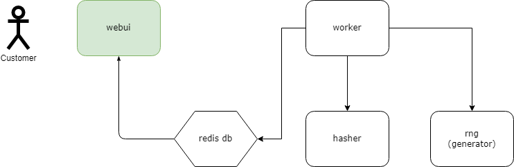
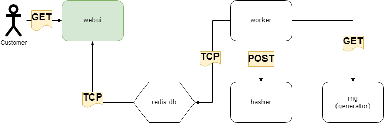
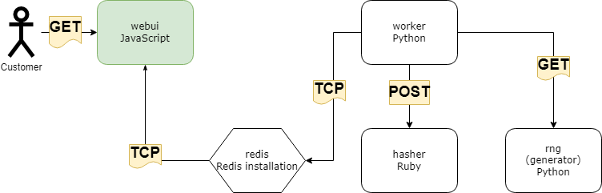
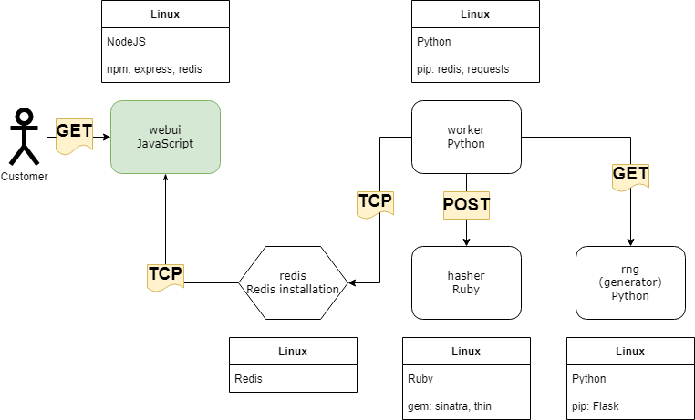
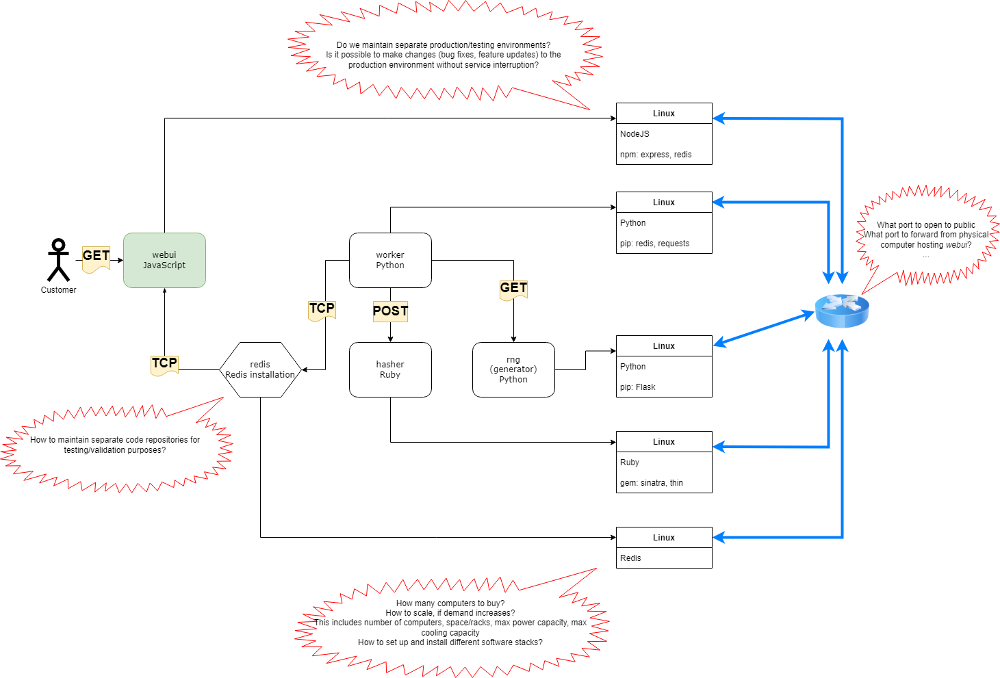
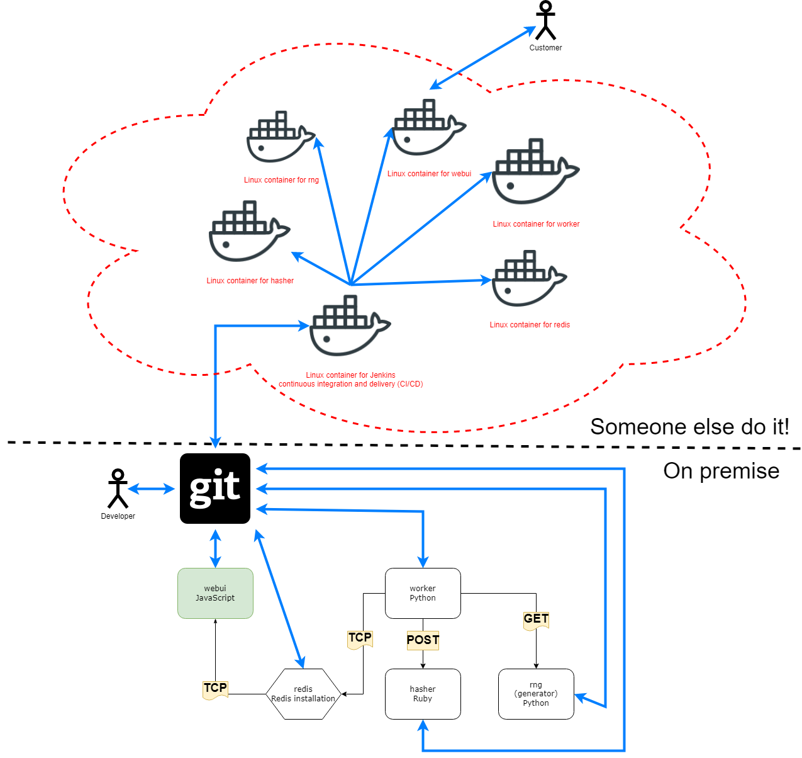
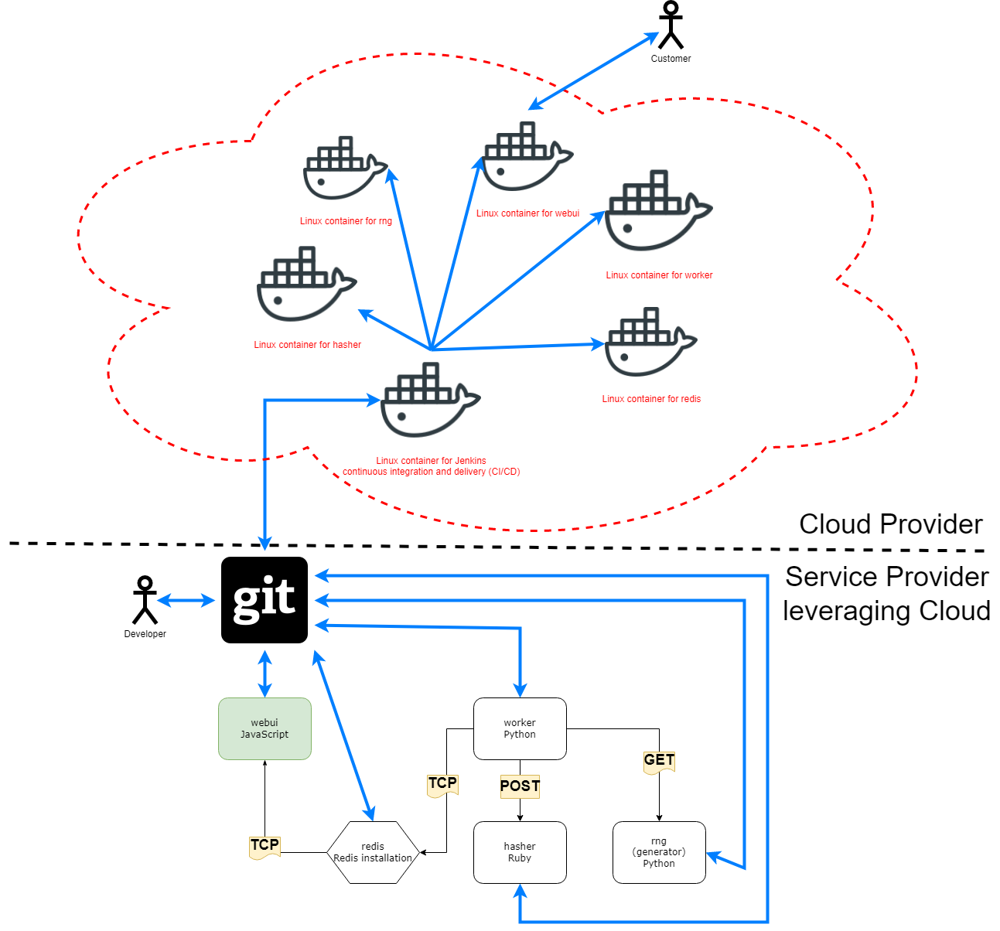
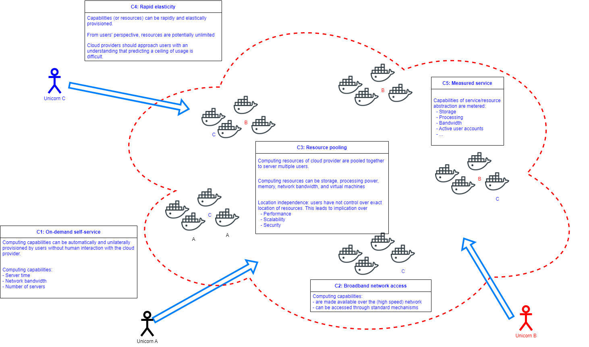
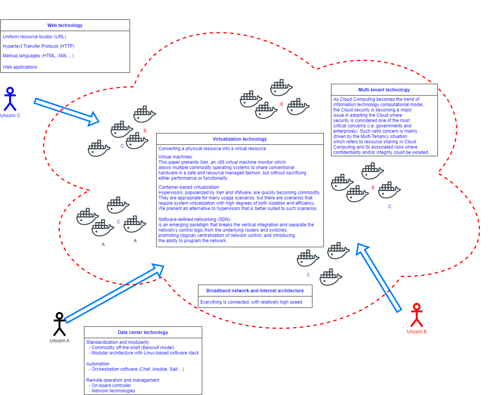

# Introduction to Cloud Computing

```{admonition} 1. A design for a up-and-coming unicorn startup
:class: dropdown

- Cryptocurrency miner startup!
  - Mine coins!
- Mining infrastructure:
  - `worker`, `rng`, `hasher`, `redis`, `webui`. 
   


- How does this work?
  - `rng` produces a constant stream of random bytes
  - `worker` issues a **GET** call to `rng` to acquire a number of random bytes. 
  - `worker` issues a **POST** call to `hasher` to hash these bytes. 
  - `worker` updates `redis` to indicate how many *coins* (loops) were done. 
  - `webui` queries `redis` to acquire the rate, then compute and visualize the rate on a web page. 
- This is only the **design** stage



- This is a common general design for many commercial/production system. 
- Another name: `full stack`
  - front-end: `webui` 
  - back-end: `worker`, `hasher`, `rng`
  - database: `redis`

```

```{admonition} 2. Implementation stage
:class: dropdown

- How does the startup implement their design?



```


```{admonition} 3. Deployment stage
:class: dropdown

- Deploy one component per Linux machine!



- **Is this really everything?**

```


```{admonition} 4. Reality of deployment in production environment
:class: dropdown

- Significant considerations need to be made to selection of hardware (computers and network), software, 
and other physical limitations (spaces, power, cooling).
  - Differences in software stacks for different components
  - Differences in network security requirements for different computers hosting different components
- Cost of personnel. 
- True on-site deployment would have hindered many new startups. 



```


```{admonition} 5. A more complete deployment
:class: dropdown

- Companies/businesses are relieved from having to manage both software and physical hardware setup. 
- Hardware configurations are feasible, but physical management is not required. 
- Dynamic scaling of resources



```


```{admonition} 6. Cloud computing is the answer
:class: dropdown

- [The National Institute of Standards and Technology (NIST/Department of Commerce) Definition of Cloud Computing](https://csrc.nist.gov/publications/detail/sp/800-145/final):
- Cloud computing is a model for enabling ubiquitous, convenient, on-demand network access to a shared 
pool of configurable computing resources (e.g., networks, servers, storage, applications, and services) 
that can be rapidly provisioned and released with minimal management effort or service provider 
interaction. 



- This cloud model is composed of 
  - Five essential characteristics 
  - Three service models, and 
  - Four deployment models.

```

```{admonition} 7. NIST: Five essential characteristics of cloud computing
:class: dropdown

- C1. On-demand self-service
- C2. Broad network access
- C3. Resource pooling
- C4. Rapid elasticity
- C5. Measured service



```


```{admonition} 8. NIST: Enabling technologies (equal order of importance)
:class: dropdown

- Broadband networks and Internet architecture
- Data center technology
- Virtualization technology
- Web technology
- Multi-tenant technology



```

```{admonition} 9. Course project and course progress: the big picture
:class: dropdown

- Project-driven course
- General project statement: Enhance the implementation and carry out the full stack deployment (including CI/CD services) 
of the coin miner design (described in Slide 1) on an academic cloud. 
- Throughout the course, you will learn about:
  - Theory behind **virtualization**. 
  - Modern data center technologies.
  - Modern cloud orchestration technologies. 
- Recurrent skills:
  - To be performed in similar way over various problems.
  - Linux-based system administration
  - Git repository. 
  - Deploying and managing a cloud infrastrucure. 
- Non-recurrent skills (variable-component/open skills):
  - Be able to design a complete micro-service architecture, 
  including components for in-house development/integration. 
  - Be able to design and implement individual microservice
  using appropriate containerization solution. 

```

``{admonition} 10. Challenges
:class: dropdown

[Spring 2022's students response to survey](https://docs.google.com/document/d/1KBTX0v0yE8iAhJl_6QwAdYZR1tsGiVXnN79XIfgDHEg/edit?usp=sharing)

```