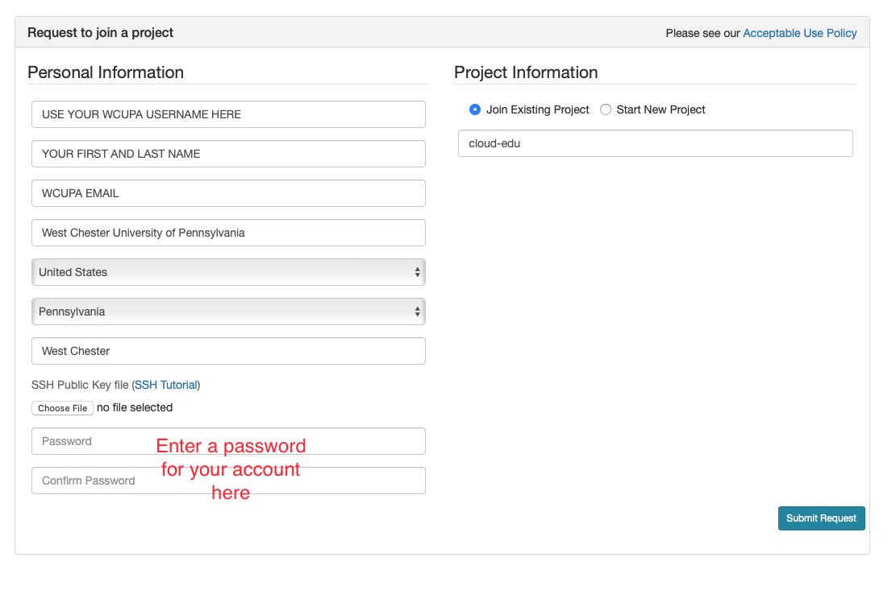
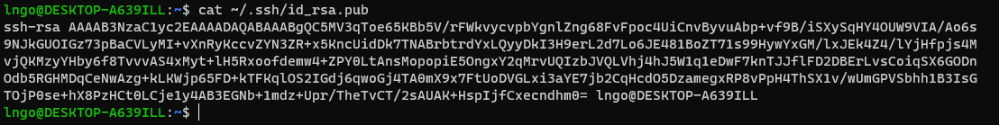
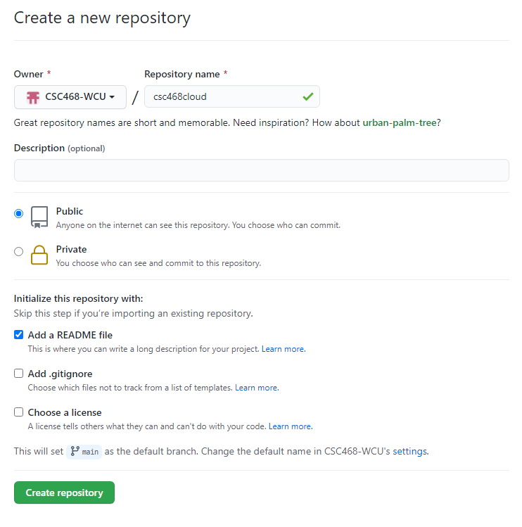
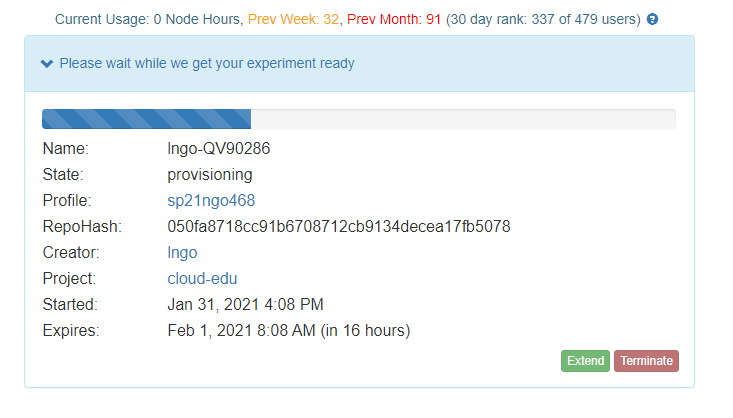

# Introduction to CloudLab

## 1. CloudLab    
 
```{admonition} Overview
:class: dropdown

- Visit [CloudLab's website](https://cloudlab.us)
- Click "Request an Account" 
- Fill in the information as shown in the following figure and click "Submit Request"
- Wait for a confirm
ation email to arrive in your wcupa.edu mailbox. You might have to 
resubmit a new request if you don't see this email in about half an hour. 



- After your account is confirmed, the instructor will be able to see your application 
and can grant you access to CloudLab. 
- If you already had a CloudLab account, you can select `Start/Join Project` under
your username, then select `Join Existing Project` and provide the name `cloud-edu`. 

```


```{admonition} CloudLab Network
:class: dropdown

- Experimental testbed for future computing research
- Allow researchers control to the bare metal
- Diverse, distributed resources at large scale
- Allow repeatable and scientific design of experiments


```


```{admonition} GENI
:class: dropdown

- Global Environment for Networking Innovation
- Combining heterogeneous resource types, each virtualized 
along one or more suitable dimensions, to produce a single 
platform for network science researchers"
- Key components:
  - GENI racks: virtualized computation and storage resources
  - Software-defined networks (SDNs): virtualized, programmable network resources
  - WiMAX: virtualized cellular wireless communication

*Berman, M., Chase, J.S., Landweber, L., Nakao, A., Ott, M., Raychaudhuri, 
D., Ricci, R. , and Seskar, I., 2014. GENI: A federated testbed for innovative 
network experiments. Computer Networks, 61, pp.5-23.*

```


```{admonition} Key experimental concepts
:class: dropdown

- Sliceability: the ability to support virtualization while 
maintaining some degree of isolation for simultaneous experiments
- Deep programmability: the ability to influence the behavior of 
computing, storage, routing, and forwarding components deep inside the 
network, not just at or near the network edge.

```


```{admonition} CloudLab Hardware
:class: dropdown

- Utah/HP: Low-power ARM64 (785 nodes)
  - 315 m400: 1X 8-core ARMv8 at 2.4GHz, 64GB RAM, 120GB flash
  - 270 m510: 1X 8-core Intel Xeon D-1548 at 2.0 GHz, 64GB RAM, 256 GB flash
  - 200 xl170: 1X 10-core Intel E5-2640v4 at 2.4 Ghz, 64 GB RAM, 480 GB SSD
- Wisconsin/Cisco: 530 nodes
  - 90 c220g1: 2X 8-core Intel Haswell at 2.4GHz, 128GB RAM, 1X 480GB SDD, 2X 1.2TB HDD
  - 10 c240g1: 2X 8-core Intel Haswell at 2.4GHz, 128GB RAM, 1X 480GB SDD, 1X 1TB HDD, 12X 3TB HDD
  - 163 c220g2: 2X 10-core Intel Haswell at 2.6GHz, 160GB RAM, 1X 480GB SDD, 2X 1.2TB HDD
  - 7 c240g2: 2X Intel Haswell 10-core at 2.6GHz, 160GB RAM, 2X 480GB SDD, 12X 3TB HDD
  - 224 c220g5: 2X 10-core Intel Skylake at 2.20GHz, 192GB RAM, 1TB HDD
  - 32 c240g5: 2X 10-core Intel Skylake at 2.20GHz, 192GB RAM, 1TB HDD, 1 NVIDIA P100 GPU
  - 4 c4130: 2X 8-core Intel Broadwell at 3.20GHz, 128GB RAM, 2X 960GB HDD, 4 NVIDIA V100
- Clemson/Dell: 281 nodes
  - 96 c8220: 2X 10-core Intel Ivy Bridge at 2.2GHz, 256GB RAM, 2X 1TB HDD
  - 4 c8220x: 2X 10-core Intel Ivy Bridge at 2.2GHz, 256GB RAM, 8X 1TB HDD, 12X 4TB HDD
  - 84 c6420: 2X 14-core Intel Haswell at 2.0GHz, 256GB RAM, 2X 1TB HDD
  - 2 c4130: 2X 12-core Intel Haswell at 2.5GHz, 256GB RAM, 2X 1TB HDD, 2 NVIDIA K40m
  - 2 dss7500: 2X 6-core Intel Haswell at 2.4GHz, 128GN RAM, 2X 126GB SSD, 45X 6TB HDD
  - 72 c6420: 2X 16-core Intel Skylake at 2.6GHz, 386GB RAM, 2X 1TB HDD
  - 6 ibm8335: 2X 10-core IBM POWER8NVL at 2.87GHz, 512GB RAM, 1X 2TB HDD, 2 NVIDIA GV100GL
  - 15 r7515: 2X 32-core AMD EPYC Rome at 2.9GHz, 512GB RAM, 1X 2TB HDD, 2 NVIDIA GV100GL

```


## 2. Setup SSH


```{admonition} Command line terminal software 
:class: dropdown
 
- Download and install [Windows Terminal from the Microsoft Store](https://www.microsoft.com/en-us/p/windows-terminal/9n0dx20hk701?activetab=pivot:overviewtab).

```

```{admonition} Command line terminal software on Mac
:class: dropdown

- Use the Search box (magnifying glass on top-right of your Mac Desktop) and 
type in the word `Terminal`. 
- Launch the resulting Terminal app. 

```

```{admonition} SSH setup
:class: dropdown

- Launch your terminal (Windows Terminal or Mac) and run the following command: 
- Hit `Enter` for all questions. **Do not enter a password or change the default location of the files**. 

~~~bash
cd
ssh-keygen -t rsa
~~~


- Run the following command to display the public key
- Drag your mouse over to paint/copy the key (just the text, no extra spaces after the last 
character)

~~~bash
cat ~/.ssh/id_rsa.pub
~~~



- Log into CloudLab, click on your username (top right) and select `Manage SSH Keys`:


- Paste the key into the `Key` box and click `Add Key`: 


```


## 3. CloudLab Profiles and Experiments

```{admonition} Setup GitHub repository
:class: dropdown

- Go to your GitHub account, under `Repositories`, select `New`. 


- You can select any name for your repo. 
- Repository must be `public`. 
- The `Add a README file` box must be checked. 
- Click `Create repository` when done.  



- Click `Add file` and select `Create new file`


- Type `profile.py` for the file name and enter the content below into the text editor. 
- Click `Commit new file` when done. 

<script src="https://gist.github.com/linhbngo/6d5747ab8f04763f9dc265c361d7ebcf.js?file=profile-basic.py"></script>

```


```{admonition} Profile creation and experiment instantiation
:class: dropdown

- Login to your CloudLab account, click `Experiments` on top left, 
select `Create Experiment Profile`. 


- Click on `Git Repo`


- Paste the URL of **your** previously created Git repo here and click `Confirm`


- Enter the name for your profile, put in some words for the Description. 
- You will not have a drop-down list of Project. 
- Click `Create` when done. 


- Click `Instantiate` to launch an experiment from your profile. 


- Select a Cluster from Wisconsin, Clemson, or Emulab, then click `Next`. 
- Do not do anything on the next `Start on date/time` screen. Click `Finish`.  


- Your experiment is now being `provision`, and then `booting  




- When it is ready, you can use the provided SSH command to log in to your experiment (assuming 
your key was set up correctly). 
- The command is in the **List View** tab. 


```

