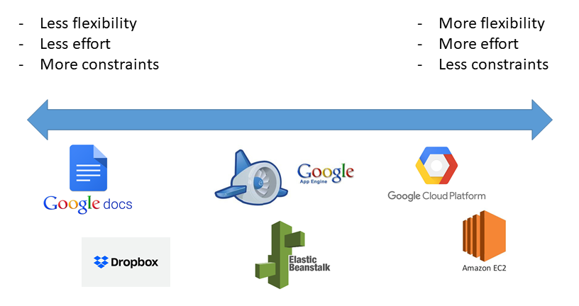
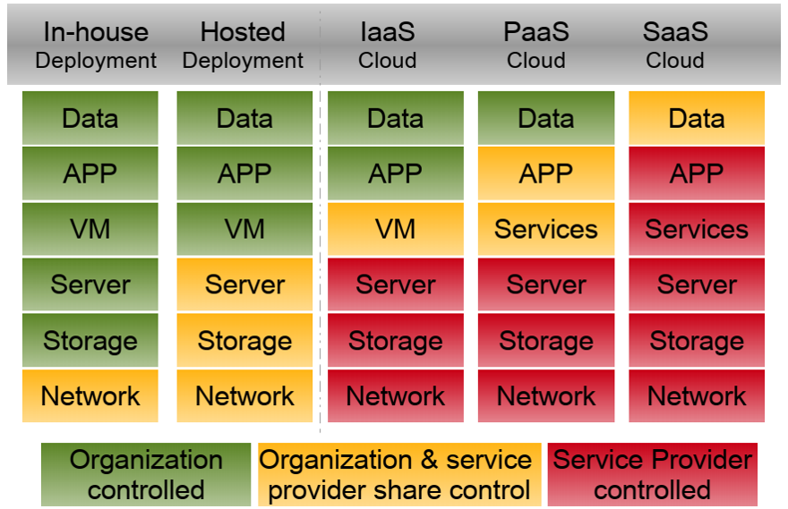

# Why Cloud

## 1. What services does Cloud offer?

- Before we can evaluate the necessity of moving to the cloud, we need to 
to know what services are available. 
  - SaaS: Software-as-a-Service
  - PaaS: Platform-as-a-Service
  - IaaS: Infrastructure-as-a-Service
- Vendor: cloud service provider. 


## 2. SaaS: Software-as-a-Service

```{admonition} Overview
:class: dropdown

- Vendor controlled applications that are accessed over the network by users.
- Characteristics:
  - Network-based access
  - Multi-tenancy
  - Single software release for all
- Examples:
  - Applications in the Google Suite
  - Dropbox
  - Cisco WebEx

```

```{admonition} Application Design
:class: dropdown

- Net native
  - Cloud-specific design, development, and deployment
  - Multi-tenant data
  - Built-in metering and management
  - Browser-based
  - Customization via configuration
- High degree of configurability, efficiency, and scalability

```


```{admonition} Disadvantages
:class: dropdown

- SaaS providers are dependent on network and cloud service providers.
  - [A Dropbox story](https://www.wired.com/2016/03/epic-story-dropboxs-exodus-amazon-cloud-empire/)
- Performance is dependent on individual client's bandwidth.
- Security
  - Good: Better security than personal computers
  - Bad: SaaS vendors (and cloud providers) are in charge of the data
  - Ugly: Privacy

```


```{admonition} Privacy: Google Drive ToS
:class: dropdown

- Who owns your data in SaaS?
- [Google Drive ToS](https://support.google.com/drive/answer/2450387?hl=en)

```


```{admonition} Privacy: Google ToS
:class: dropdown

- Who has access to your data in SaaS?
- [Google ToS](https://policies.google.com/terms?hl=en&gl=us)

```

## 3. PaaS: Platform-as-a-Service

```{admonition} Overview
:class: dropdown

- Vendors provide development environment.
  - Tools and technologies are selected by vendors.
  - Users maintain control over data (application) life-cycle.
- Examples:
  - Google App Engine
  - AWS Elastic Beanstalk
  - Heroku

```


```{admonition} PaaS: Architectural characteristics
:class: dropdown

- Support multi-tenancy at various scale: sessions, processes, and data.
  - Isolation at: physical, virtual, and logical levels
  - [Microsoft’s offerings of isolation choices](https://docs.microsoft.com/en-us/azure/security/fundamentals/isolation-choices)
- Native scalability
  - Load balancing and fail-over (AWS Elastic Beanstalk)
- Native integrated management
  - Performance
  - Resource consumption/utilization
  - Load

```


```{admonition} PaaS: Disadvantages
:class: dropdown

- Inherits all from SaaS
- Options on technologies and tools are limited by the PaaS vendors

```

## 4. IaaS: Infrastructure-as-a-Service

```{admonition} Overview
:class: dropdown

- Vendors provide computing resources.
- Users provision computing resources.
  - Compute resources include processing, storage, memory, network etc.
  - Users are provided with customized virtual machines.
- Users maintain control over:
  - Operating system, memory
  - Storage,
  - Servers and deployment configurations, and
  - Some limited control over network resources via software-defined networking

```


```{admonition} Advantages
:class: dropdown

- Infrastructure scalability
- Native-integrated management via vendors' utilities
  - Performance, resource consumption/utilization, load
- Economical cost
  - Hardware, IT support

```


```{admonition} Disadvantages
:class: dropdown

- Require more technical efforts than SaaS and PaaS. 

```

## 5. Comparing service models

```{admonition} Flexibility-effort-constraints
:class: dropdown



```


```{admonition} Sharing of controls: Organization versus Provider
:class: dropdown



```


```{admonition} XaaS: Everything-as-a-Service
:class: dropdown

- Composite second level services
- [NIST Evaluation of Cloud Computing Services (2018) p. 20](https://nvlpubs.nist.gov/nistpubs/SpecialPublications/NIST.SP.500-322.pdf)

```

## 6. NIST: Four deployment models

```{admonition} Four deployment models
:class: dropdown

- Private Cloud
- Community Cloud
- Public Cloud
- Hybrid Cloud

```


```{admonition} Private cloud
:class: dropdown

- Infrastructure is organized solely for an organization
- Infrastructure is managed by the organization or by a third party

```


```{admonition} Community cloud
:class: dropdown

- Supports a specific community
- Infrastructure is shared by several organizations
- Examples: CloudLab

```


```{admonition} Public cloud
:class: dropdown

- Infrastructure is made available to the general public
- Infrastructure is owned by an organization selling cloud services
- Example: Azure Notebook free tier. 

```


```{admonition} Hybrid cloud
:class: dropdown

- Infrastructure is a composition of two or more clouds deployment models.
- Enables data and application portability

```

## 7. Computer Security

```{admonition} Who is doing what
:class: dropdown

- The cloud provider is responsible for the security **OF** the Cloud.
- The cloud consumer (users) is responsible for the security **IN** the Cloud.

```


```{admonition} Cloud consumer
:class: dropdown

- SaaS/PaaS:
  - Standard security procedure for online presences.
- IaaS:
  - Standard security procedure as any on-premise infrastructures.
  - Benefits from native administrative tools from the Cloud Provider.
```


```{admonition} Cloud provider: SaaS security
:class: dropdown

- SaaS:
  - Web application security: [OWASP's Top 10](https://owasp.org/www-project-top-ten/)
  - Multi-tenancy: data isolation/leakage
  - Data security: accessibility versus security trade-off

```


```{admonition} Cloud provider: PaaS security
:class: dropdown

- Similar security concerns as SaaS
- Complex security schemes due to potential third-party relationships.
- Development Lifecycle
  - Users depend on PaaS providers to patch security issues of the individual tools.

```


```{admonition} Cloud provider: IaaS security
:class: dropdown

- Standard security measures.
  - To Cloud Provider, cloud resources are on-premise.
- Concerns with virtual machines' security
- Concerns with virtual networking security

```

