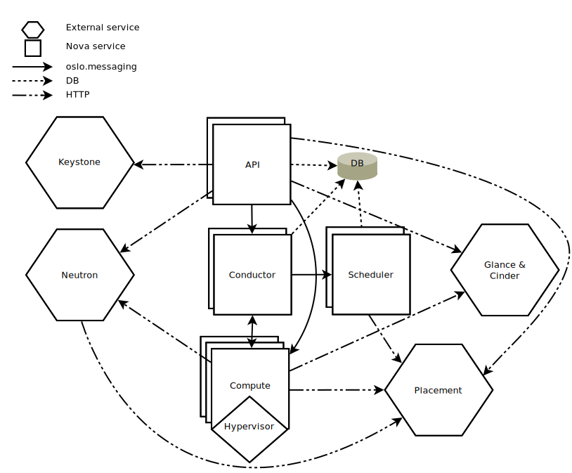

# Virtualization in Cloud Computing


## 1. Virtualization    

```{admonnition} Overview
:class: dropdown

- Operating System concept: The abstraction of available resources
- **Virtualization technologies encompass a variety of mechanisms and techniques used to address 
computer system problems such as security, performance, and reliability by decoupling the
architecture and user-perceived behavior of hardware and software resources from their physical 
implementation.** (*https:/www.computer.org/csdl/mags/co/2005/05/r5028.html/*)


```


```{admonition} Virtualization requirements
:class: dropdown

- **Formal requirements for virtualizeable third generation architectures** (Paper on D2L)
- A virtual machine is taken to be an efficient, isolated duplicate  of the real machine.
- These notions can be explained through the idea of a **virtual machine monitor**. 
- Essential characteristics of VMM:
  - Essentially identical to the physical resource
  - Efficiency
  - Complete control of system resources (with regard to the processes running inside the VM)


```


```{admonition} Virtual Machine Monitor
:class: dropdown

- Virtualization Layer: The Virtual Machine Monitor (or its modern name: **Hypervisor**) 
provides an interface between hardware and virtual operating systems.
- Type of hypervisors:
  - Bare-metal
  - Hosted


```


```{admonition} Issues that virtualization can help with
:class: dropdown

- Under-utilized resources
- Complicated system management
- Limited access to shared resources
- Inefficient power consumption
- Tight coupling with underlying resources

```


```{admonition} Virtualization versus multitasking versus multicore/hyperthreading
:class: dropdown


```


## 2. Types of virtualization

```{admonition} Overview
:class: dropdown

- Platform Virtualization
- Memory Virtualization
- Desktop Virtualization
- Application Virtualization
- Network Virtualization
- Storage Virtualization

```


```{admonition} Platform virtualization
:class: dropdown

- Full Virtualization
- Para Virtualization
- Hardware assisted virtualization
- OS level virtualization

```


```{admonition} Without virtualization
:class: dropdown

- x86 offers four levels of privilege (Ring 0 through 3)
- OS needs to have access to hardware and run on ring 0
- Application runs on ring 3, gain access to hardware by trapping into kernel mode for 
privileged instructions.
- Virtualizing x86 requires a layer under OS (which already at lowest level) to create 
and manage the VM
- Sensitive instructions must be executed in ring 0 


```


```{admonition} Full virtualization
:class: dropdown 

- Guess OS is unaware of host OS.
  - VMM provides virtual BIOS, virtual devices, and virtual memory management.
- Non-critical instructions run directly on hardware.
- Runtime translation of critical non-virtualizable instructions happens in the hypervisor.
- Provide best isolation and security at the cost of performance.


```


```{admonition} Para virtualization
:class: dropdown

- Thin layer interfaces between each guest OS and underlying hardware.
- Need guest kernel modification.
- No need of runtime translation for critical instructions.
- Superior in performance.
- Requires expertise to patch the kernels.


```


```{admonition} Hardware-assisted virtualization
:class: dropdown

- Hardware provides support to run instructions independently.
  - Intel Virtualization Technology (VT-x)
  - AMD Virtualization Technology (AMD-V)
- No need to patch the kernels.
- Runtime translation not required.
- Better performance in comparison to other variants.
- Greater stability


```


```{admonition} Virtualization at OS level
:class: dropdown

- Same OS for both host and guest machines.
- User space is completely isolated.
- High performance.
- Extremely light-weight.

```


```{admonition} Memory virtualization
:class: dropdown

- How to share physical system memory and dynamically allocating it to virtual machines.
- Guess OS maps virtual memory space (of VM) to physical memory space (of VM).
- VMM translates physical memory space (of VM) to physical memory space (of main machine), 
but also enables direct mapping (shadow table) to avoid overhead.


```


```{admonition} Summary
:class: dropdown

:::::{tab-set} 
::::{tab-item} Comparative isses

- Guess modification/compatibility
- Performance
- Guest OS hypervisor/independent
 
::::
::::{tab-item} Full/binary translation

- Unmodified guest OS, excellent compability
- Good
- Yes

::::
::::{tab-item} Hardware assisted

- Unmodified guess OS, excellent compatibility
- Fair
- Yes

::::
::::{tab-item} OS assisted/para

- Guest OS codified to run Hypercall
  - Cannot run off native hardware or other hypervisors
  - Poor compatibility
- Better on certain cases
- Xen Linux runs only Xen Hypervisor
  - VM-Linux is hypervisor-agnostic

::::
:::::

```


```{admonition} Desktop and application virtualization
:class: dropdown

- Desktop and Applications run on servers.
- Stateless thin clients connected to servers.
- Efficient system management.
- Requires high-end servers for system stability

```

```{admonition} Network and storage virtualization
:class: dropdown

- Similar idea of providing an abstraction layer to the physical infrastructures
- In networks, abstraction will
  - Be at the level of routers, switches, gateway, firewalls, load balancers, …
  - Enabled by software-defined networking
- In storage, single storage backends can be used for different requirements
  - Ephemeral
  - Persistent
  - Specialize storage backends

```


## 3. Virtualization: concept of overcommits

```{admonition} Overview
:class: dropdown

- Allocating more than the available physical resources to the Guest OS
- Common types of overcommit:
  - CPU 
  - Memory 
  - Storage 

```


```{admonition} Virtualization: concept of overcommits
:class: dropdown

- Advantages:
  - Favorable economic model
  - Efficient resource utilization
  - Support green computing
- Disadvantages:
  - Performance loss or unstable system response
  - Complex system understanding
  - VM shutdown by the hypervisor

```


```{admonition} Virtualization: CPU and memory overcommits
:class: dropdown

- Allows more virtual CPUs than physically available
  - Openstack KVM: overcommit-number = 16.0
- Allow more memory than physically available
  - Overstack KVM: overcommit-number = 1.5GB

```


```{admonition} Virtualization hypervisors
:class: dropdown

- Contribution from industry and academia
- Xen: Project from Cambridge Computer Laboratory
- VMware: Commercial product
  - Also comes from academic research (see Mendel Rosenblum ACM)
- KVM: Initiated by the Open Virtualization Alliance, later dissolved and is now managed 
by the Linux Foundation
- Qemu: Open source machine emulator and virtualizer

```


## 4. Virtualization in the cloud: OpenStack

```{admonition} Logical Architecture
:class: dropdown

- [OpenStack Design](https://docs.openstack.org/arch-design/design.html)
- Module types:
  - Daemon: runs as a background process.
  - Script: installs a virtual environment and runs tests.
  - Command-line interface (CLI): enables users to submit API calls to OpenStack services


- Compute: Provision compute instances
- Keystone: Identity and authentication
- Glance: Compute image repository
- Neutron: Provision virtual/physical networks
- Placement: Tracking inventory of resources available in a cloud
- Cinder: Provision blcok storages

```

```{admonition} OpenStack: Compute
:class: dropdown

- Message-based, "share-nothing" architecture
  - User-facing: REST API
  - Internal communication: RPC
- Supported/controlled hypervisors:
  - Baremetal
  - Hyper-V
  - KVM
  - Linux Containers (LXC)
  - Quick Emulator (QEMU)
  - Virtuozzo
  - VMWare vSphere
  - zVM



```


```{admonition} Openstack: Cinder
:class: dropdown

- Providing volumes to VMs, baremetal hosts, containers, etc. 


```


```{admonition} Openstack: Neutron
:class: dropdown

- Management: internal comm between OpenStack components, reachable only within the 
data center.
- Guest: Used for VM data communication within the Cloud Deployment.
- External: Provide VM with Internet access.
- API: Exposed all the Stack’s API to the public.


```
