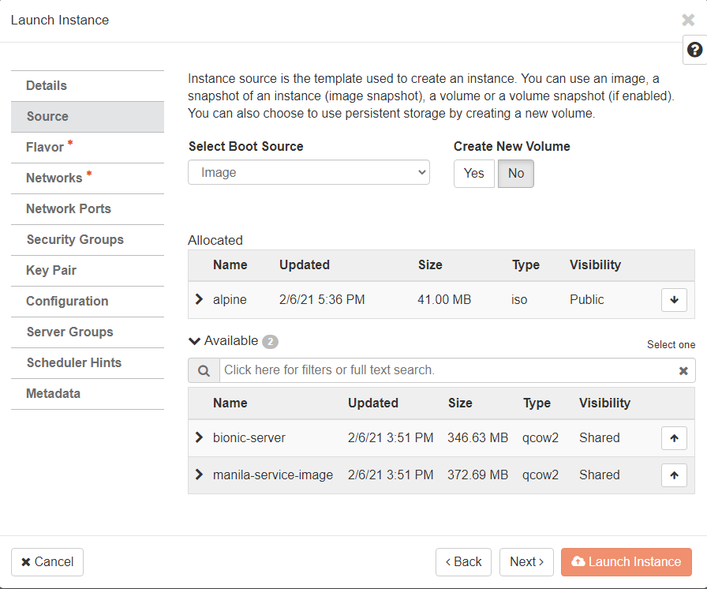
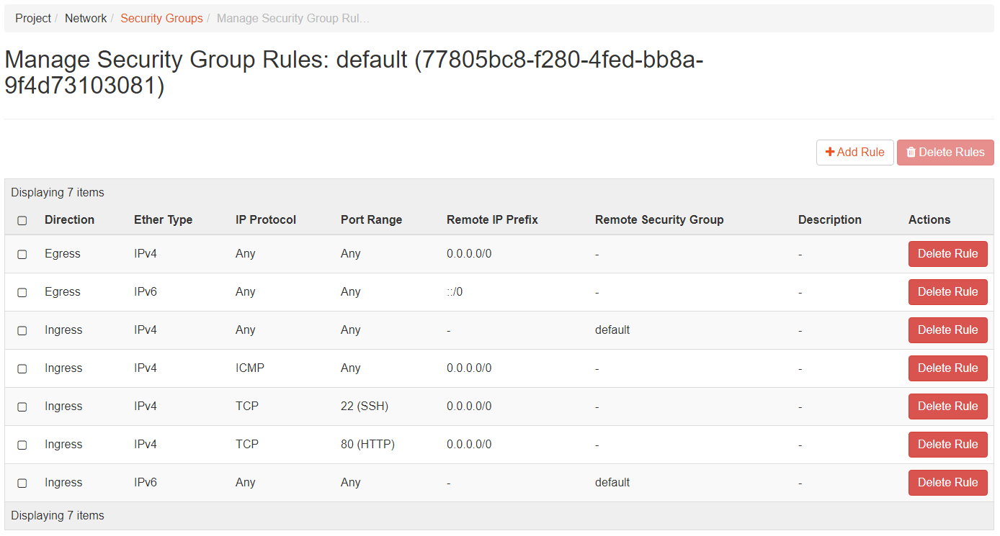

# Programmatic Deployment of Infrastructures
 
```{admonition} 1. Find CloudLab profile for OpenStack
:class: dropdown

- Log into [CloudLab](https://www.cloudlab.us/)
- Under **Experiments** drop down box, select **Start Experiment**.


- Click **Change Profile**. 


- Type **OpenStack** in the search box, and select the profile **OpenStack** 
as shown in the figure below. 
  - Created By: `johnsond`
  - Last Updated: `2017-12-20 10:05:21`
  - Click **Select Profile** when done. 


- Click **Next**. 


- Select the options similar to the figure below. 
- If the **Parameterize** tab does not look like this, click **Previous** to 
go back one step, and then click **Next** again.


- Only **Utah**, **Wisconsin**, and **Clemson** have been known to work with this 
profile. 
- I will use **Utah** for the remaining steps. 


- Do not change anything on the **Schedule** step and click **Finish**. 


- The startup scripts of this profile will take sometimes to run, approximately 
**thirty minutes to one hour**. 
- You will receive an email from CloudLab (to the registered) to inform you when 
the experiment is ready. 


- Go to the experiment, and open the blue *Profile Instructions** box. 


- Follow the instructions to login to OpenStack dashboard. Your passwords 
will be randomly generated and unique to each experiment. 


- You will see a Dashboard on a successful deployment as follows.


```

```{admonition} 2. Deploying compute resources from OpenStack    
:class: dropdown

- In the next sequence of hands-on, we will look at how OpenStack can 
support the deployment of a virtual machine inside its Nova compute 
components. 

```

```{admonition} 3. Hands-on: Download Linux distribution
:class: dropdown

- We will use Alpine Linux, a light-weight distribution that was created
for containerization/cloud deployment. 
- From [Alpine Download Page](https://alpinelinux.org/downloads/), select the 
x86_64 Virtual version. 


```

```{admonition} 4. Hands-on: Create cloud image
:class: dropdown

- Go to your CloudLab Dashboard. 
- Go to **Compute**/**Images**, then click on **Create Image**.  


- Click **Browse** and find and select the downloaded ISO file from the
the previous slide. 
- Set the other parameters as shown in the figure below. 
- Click **Create Image** when done. 


- The image will show up in the **Images** tab. 


```

```{admonition} 5. Hands-on: Create volumes
:class: dropdown

- Go to your CloudLab Dashboard. 
- Go to **Volumes**/**Volumes**, then click on **Create Volume**.  


- Set the other parameters as shown in the figure below. 
- Alpine takes up a small amount of storage, so 2GB is more than enough 
for a simple installation.
- Click **Create Volume** when done. 


- The volume will show up in the **Volumes** tab. 


```

```{admonition} 6. Hands-on: Launching a compute instance
:class: dropdown

- Go to your CloudLab Dashboard. 
- Go to **Compute**/**Instances** and click on **Launch Instance**.  


- Set the instance name and other parameters, then click **Next**


- Use the up arrow to select the **alpine** image as the allocated image. 
Click **Next**. 



- Select **m1.tiny** as the compute flavor. Click **Next**. 


- Select **flat-lan-1-net** as the connected network. Click **Launch Instance**. 


- It should take a few minute for the instance to become ready. 


```

```{admonition} 7. Hands-on: Volume attachment and Linux installation
:class: dropdown

- Go to your CloudLab Dashboard. 
- Go to **Compute**/**Instances**
- Click on the drop-down arrow under **Actions** for the alpine instance, 
then click **Attach Volume**.  


- Select your `sda_****` volume ID created earlier, then click **Attach Volume**


- Click on the drop-down arrow under **Actions** for the alpine instance. 
- Select **Console**.


- Right click on **Click here to show only console** and select 
**Open link in new tab**.
- This helps with navigating back and forth.  


- A new console tab appears! 
- You are now booting from the Alpine distro. 


- Type **root** into the`localhost login:` prompt and hit Enter to log in. 


- A quick review of Alpine installation process can be found 
on [their wiki](https://wiki.alpinelinux.org/wiki/Install_to_disk)
- Type `setup-alpine` and hit Enter to start the installation process. 
- Use the following options:
  - `Select keyboard layout`: `us`
  - `Select variant`: `us`
  - `Enter system hostname ...`: Hit Enter to accept default. 
  - `Which one do you want to initialize?`: Hit Enter to accept `eth0` as the default interface. 
  - `Ip address for eth0`: Hit Enter to accept `dhcp` as the default value. 
  - `Do you want to do any manual network configuration?`: Hit Enter to accept `n` as the default value. 
  - Enter a **complex** password for root. DO NOT MAKE AN EASY PASSWORD. If your cloud instance got 
  hacked and used for malicious purposes, you will be banned from CloudLab. Retype the password. 
  - `Which timezone are you in?`: Type `EST` and hit Enter. 
  - `HTTP/FTP proxy URL?`: Hit Enter to accept `none` as the default value. 
  - For the mirror question, type `30` (the one from princeton), then hit Enter. 
  - `Which SSH server?`: Hit Enter to accept `openssh` as the default value. 
  - `Which disk(s) would you like to use?`: Review the lines above, and select the listed disk. 
  There should be one as we already attached a volume to this instance. For me, it is `vdb`, so I 
  type in `vda` and hit Enter. 
  - `How would you like to use it?`: Type `sys` and hit Enter. 
  - `WARNING: Erase the above disk(s) and continue?`: Type `y` and hit Enter. 


- Once the installation process is completed, Leave this console running and return to the Dashboard. 
- Go to **Compute**/**Instances**
- Click on the drop-down arrow under **Actions** for the alpine instance.  
- Select the `sda_****` volume ID selected earlier, then click **Detach Volume**


- Select the `sda_****` volume ID created earlier, then click **Detach Volume**


- Go to your CloudLab Dashboard. 
- Go to **Volumes**/**Volumes**.  
- In the **Actions** box of `sda_****`, click the drop-down arrow and select **Upload to Image**. 


- Set **Image Name** to `alpine-disk` and **Disk Format** as `Raw`, then click 
**Upload**. 


- Successful upload:


```

```{admonition} 8. Challenge
:class: dropdown

- Launch another compute instance using the newly created `alpine-disk` image. 
  - Pay attention to the flavor. 
- Log into the console and confirm that you can use the root password created earlier to log in

![New launched instance with working image]](../fig/05-programmatic/37.png)

```


```{admonition} 9. Setup Apache webserver (from the volume-based Alpine from Challenge 8)
:class: dropdown

- You should be inside the console after log in as root and have the root password. 
- Run the following commands to install Apache webserver

~~~
$ apk update
$ apk add apache2
$ rc-service apache2 start
~~~


```


```{admonition} 10. Setup public IP address
:class: dropdown

- To expose the webserver, we need a public IP address. 
- Go to your CloudLab Dashboard. 
- Go to **Compute**/**Instances**
- Click on the drop-down arrow under **Actions** for the alpine instance, 
then click **Associate Floating IP**. 


- Click on the `+` sign to allocate IP address. 


- Click on **Allocate IP**. 


- Click on **Associate**.


- You should see the public IP address with your instance


- Try visiting this IP address now, anything?

```


```{admonition} 11. Cloud security basic
:class: dropdown

- In the cloud, `egress` means traffic that’s leaving from inside the private network out to the 
public internet (similar to standard network definition).


- In the cloud, `ingress` refers to unsolicited traffic sent from an address in public internet to 
the private network – it is not a response to a request initiated by an inside system. In this case, 
firewalls are designed to decline this request unless there are specific policy and configuration that 
allows ingress connections.


```


```{admonition} 12. Handle security
:class: dropdown

- Go to your CloudLab Dashboard. 
- Go to **Network**/**Security Group**
- Click on **Manage Rules**. 


- Click `Add Rules` 


- In the `Rule` drop down box, select `HTTP`, then click `Add`. 


- You can see the new `Ingress` rule for HTTP.



- The apache webserver is now visible


```


