# Docker Containers


## 1. Overview

```{admonition} Setup
:class: dropdown

- Go to your GitHub project repository (on the first day), create a new 
branch called `docker` from the `main branch`, 
and modify to add the following components from [this link](https://github.com/linhbngo/cloudlab/tree/docker):
  - The `docker_config` directory and its content (`daemon.json`).
  - The `install_docker.sh` file.
  - The `profile.py` file. 
- **Check and make sure all the contents are correctly copied!**
- Go to CloudLab, open your profile, switch to `Edit` mode and click `Update`. The new 
`docker` branch should show up.  
- Instantiate an experiment from this branch. 
- **Only login after the Startup column becomes Finished** and type the following 
command: 

~~~bash
sudo docker info | grep "Docker Root Dir"
~~~

- Confirm that you have something similar to the screenshot below

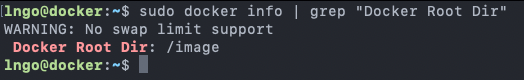

``` 

```{admonition} 1. Why do we want container?
:class: dropdown

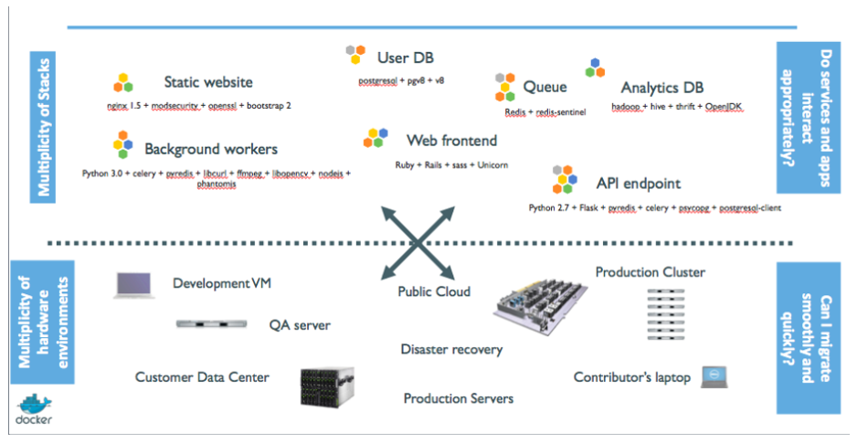

- The issue: who does what?

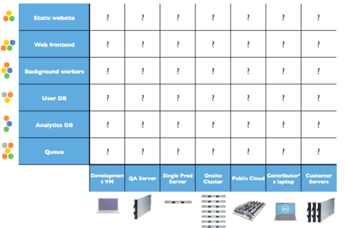

```


```{admonition} 2. Inspiration for Docker
:class: dropdown

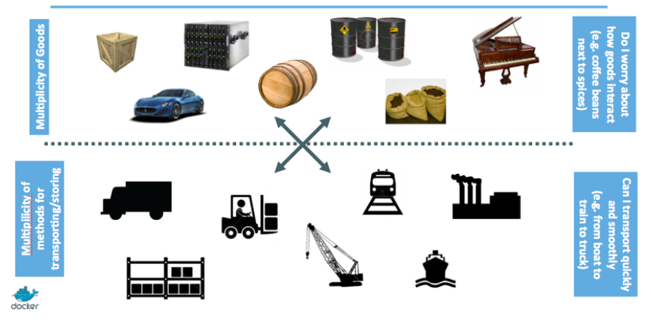

- Intermodal shipping containers

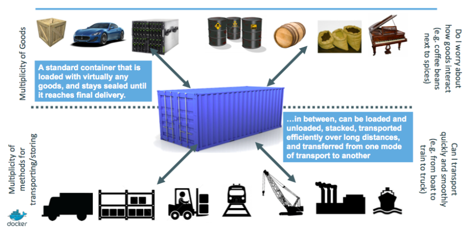

- Final results


```


```{admonition} 3. A shipping container system for applications
:class: dropdown

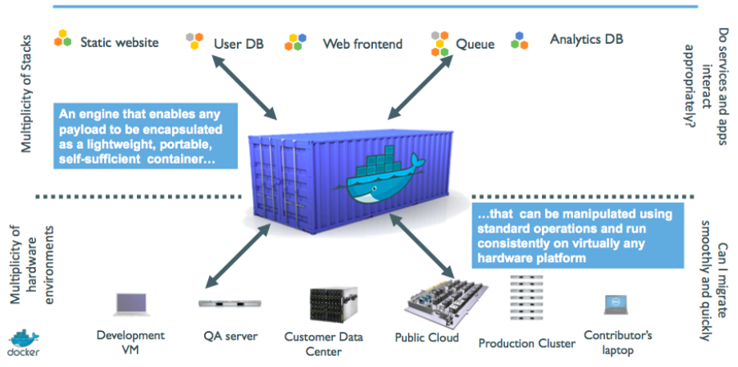

- We no longer worry about who does what

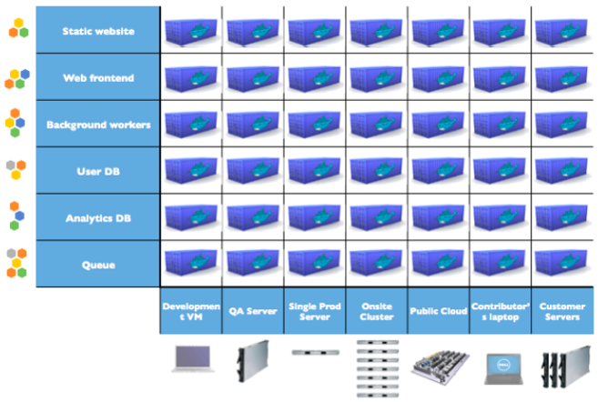

- Cloud-native applications on container

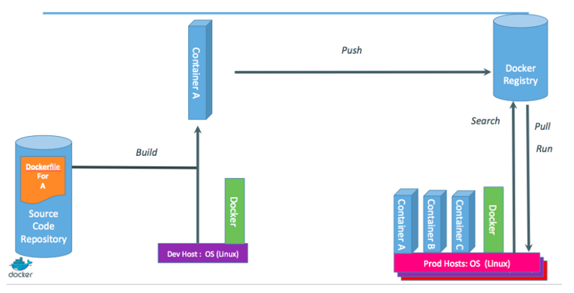

```


## 2. Docker containers

```{admonition} Getting started
:class: dropdown

- SSH into your CloudLab experiment.   
- Check version of Docker: 
  - Your version might be different from what is in the screenshot, but it should be 
  higher or equal to. 

~~~bash
docker version
~~~

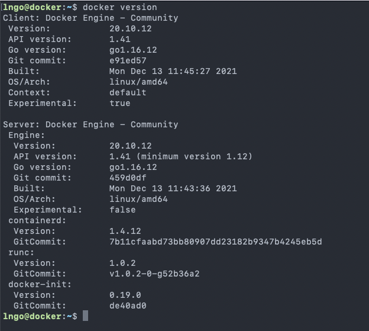

- Docker is client-server application.
  - Docker daemon (Engine): receives and processes incoming Docker API request 
  and requires root privilege.
  - Docker Hub registry: collection of public images (https://hub.docker.com/).
  - Docker client : Talks to the Docker daemon via the docker API and the registry API.

```

```{admonition} Hello world
:class: dropdown

- Docker `containers` are instantiated from Docker `images`. 
- You can check availability of local `images` and `containers`. 

~~~bash
docker image ls
docker container ls
~~~

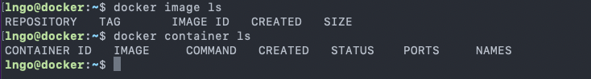

- We can issue the following to start a service that will echo `hello world` to the screen. 
- This requires a Linux container to run the `echo` command. 

~~~bash
docker run alpine echo hello world
~~~

- `docker`: invoke the container engine. 
- `run`: subcommand to run a container. 
- `alpine`: name of the image based on which a container will be launched. 
- `echo hello world`: the command to be executed in the container environment. 

~~~bash
docker image ls
docker container ls
docker container ls --all
docker run alpine echo hello world
docker container ls --all
~~~

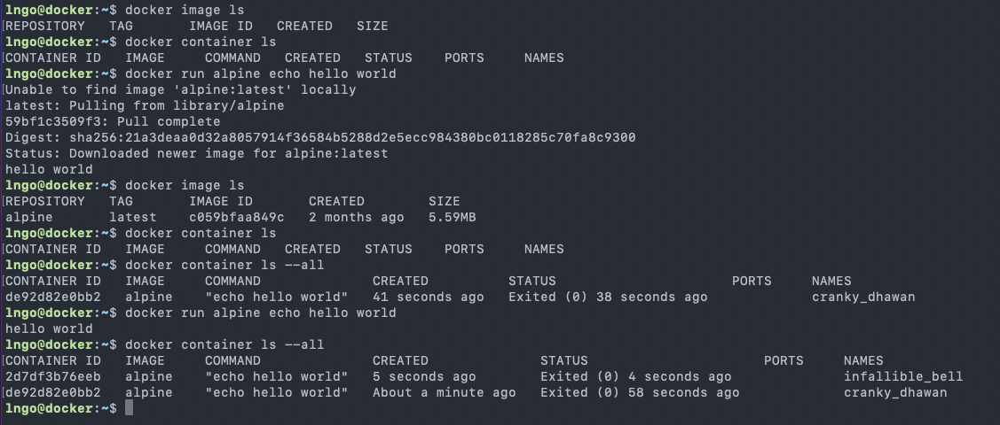

```

```{admonition} Interactive container
:class: dropdown

- We can launch a container and get into the shell of the container. 

~~~bash
docker run -it ubuntu bash
~~~

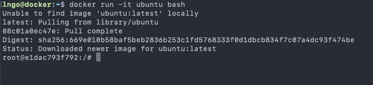

- You are now in a new prompt: a shell inside the container
- `-it`: combination of `-i` and `-t`. 
  - `-i` tells Docker to connect to the container’s stdin for interactive mode
  - `-t` tells Docker that we want a pseudo-terminal

```


```{admonition} Run something interactively
:class: dropdown

- The following commands are done inside the container. 
- Let's attempt to run `figlet`
  - **This is done inside the container**
  - You should see a `#` sign for your prompt, not a `$`. 

~~~bash
figlet hello
~~~

- There will be an error. 
- The current container does not have the `figlet` program yet. 
- We need to install `figlet`

~~~bash
apt-get update
apt-get install -y figlet
figlet hello
~~~

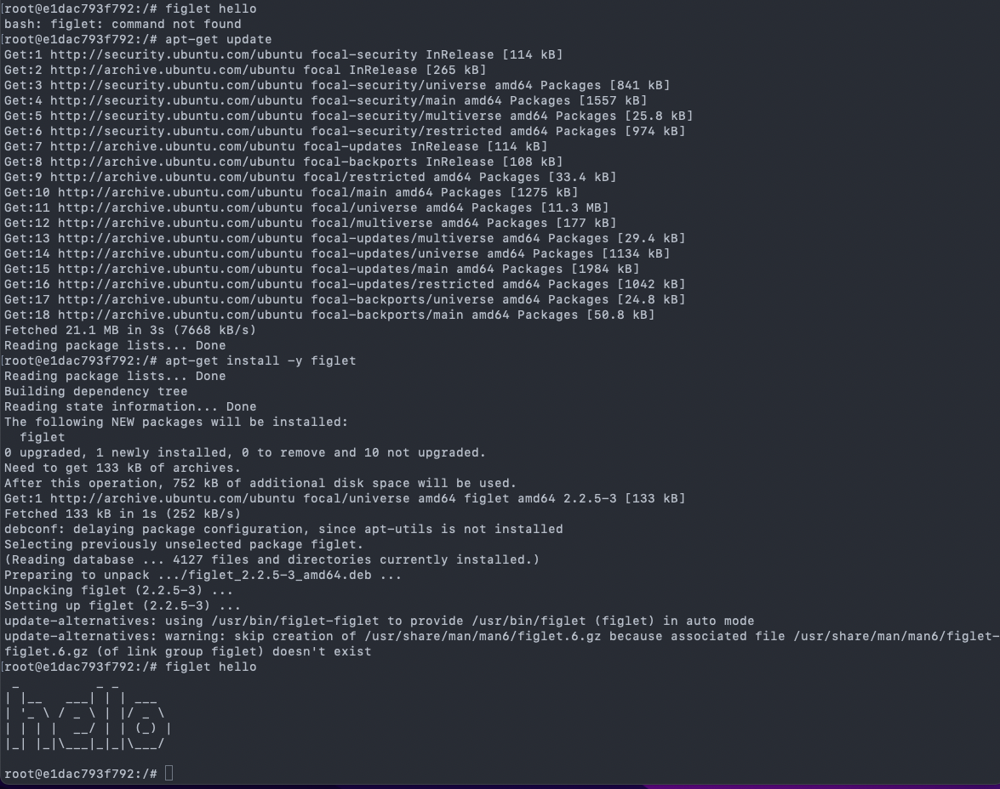

```


```{admonition} Exercise
:class: dropdown

- Type `exit` to shutdown the container and back to your normal terminal. 
- Repeat the process of launching an interactive container from start and try 
running `figlet` again. 
- Is the program still there?

```

```{admonition} Background container
:class: dropdown

- You should have already exited out of the container shell and back to the CloudLab environment. 
  - The prompt should be `$`, not `#`. 
- Run the following commands
  - Press `Ctrl-C` to stop after a few time stamps. 

~~~bash
docker run jpetazzo/clock
~~~

- Now rerun the following command 

~~~bash
docker run -d jpetazzo/clock
docker ps
~~~

- The clock app is running in the background


```


```{admonition} View log of your background container
:class: dropdown

- Use the first four characters of your container ID to view the log 
of the running Docker container
- Use `--tail N` to only look at the tail of the log. 

~~~bash
docker container ls
docker logs --tail 5 YOUR_CONTAINER_ID
~~~

```

```{admonition} Exercise
:class: dropdown

- Find out how to kill a running container by using `docker kill`. 

```


## 3. Networking for container

```{admonition} Overview
:class: dropdown

- How can services provided by a container become available to the world? 

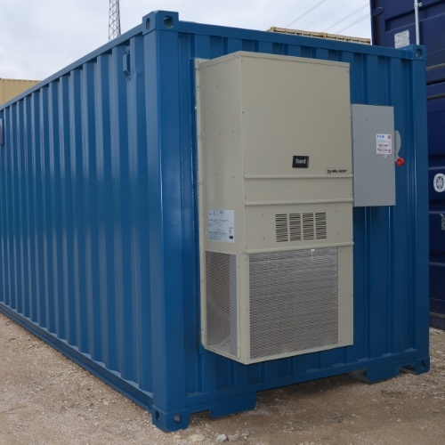

```

```{admonition} A simple web server
:class: dropdown

~~~bash
docker run -d -P nginx
docker ps
~~~

- `-P`: make this service reachable from other computers (`--publish-all`)
- `-d` : run in background
- Where is the port?

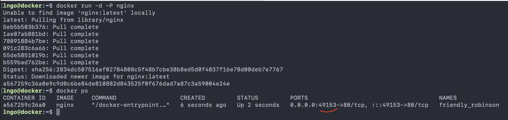

- Using this port to test the webserver

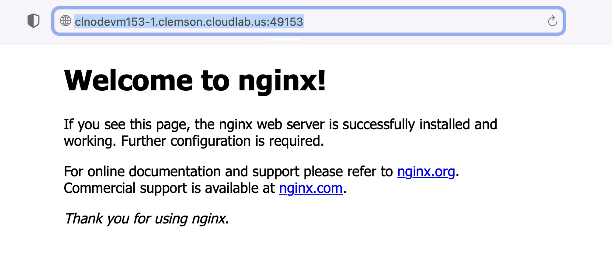

- How does the container engine know which port to map?
  - This is described in the `Dockerfile` and can be inspected. 
  - The keyword for this action is `EXPOSE`. 

~~~bash
docker inspect --format '{{json .Config.ExposedPorts}}' nginx
~~~

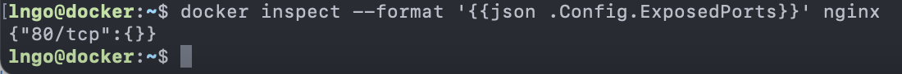

- Why do we have to map ports?
  - Containers cannot have public IPv4 addresses.
  - We are running low on IPv4 addresses anyway. 
  - Internally to host, containers have their own private addresses
    - Services have to be exposed port by port.
    - These have to be mapped to avoid conflicts.

```


```{admonition} Hands on: manual allocation of port numbers
:class: dropdown

- We can manually map external port (host) to internal port (container) using 
the `-p` flag. 

~~~
$ docker run -d -p 8000:80 nginx
$ docker run -d -p 8080:80 -p 8888:80 nginx
~~~

- Convention: `port-on-host:port-on-container`
- Check out the web servers at all of these ports 

```

## 4. Docker images

```{admonition} Overview
:class: dropdown

- Image = files + metadata
- The files form the root filesystem of the container
- The metadata describes things such as:
  - The author of the image
  - The command to execute in container when starting it
  - Environment variables to be set
  - ...
- Images are made of layers, conceptually stacked on top of each other.
- Each layer can add, change, and remove files and/or metadata.
- Images can share layers to optimize disk usage, transfer times, and memory use.


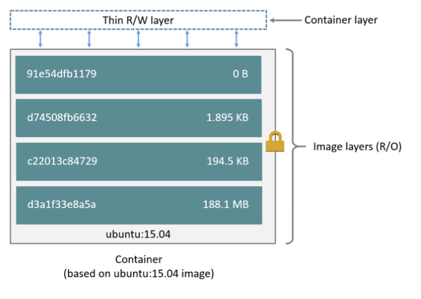

```


```{admonition} Containers versus images
:class: dropdown

- An image is a read-only filesystem.
- A container is an encapsulated set of processes running in a 
read-write copy of that filesystem.
- To optimize container boot time, copy-on-write is used instead of regular copy.
- `docker run` starts a container from a given image. 

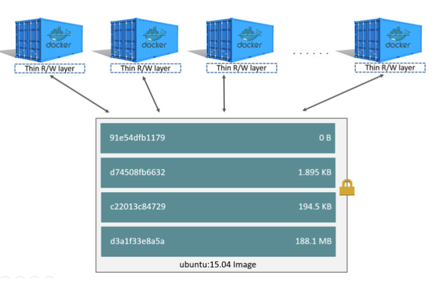

- Object-oriented analogy
  - Images are conceptually similar to classes
  - Layers are conceptually similar to inheritance
  - Containers are conceptually similar to instances

```

```{admonition} How do we change an image?
:class: dropdown

- It is read-only, we don’t.
- We create a new container from the image
- We make changes to the container. 
- When we are satisfied with the changes, we transform them into a new layer.
- A new image is created by stacking the new layer on top of the old image.

```

```{admonition} Image namespaces
:class: dropdown

- Official images (ubuntu, busybox, …)
  - Root namespace. 
  - Small, distro images to be used as bases for the building process.
  - Ready-to-use components and services (redis, postgresl …)
- User (and organizations) images: `<registry_name>/<image_name>:[version]`
  - jpetazzo/clock:latest
  - linhbngo/csc331:latest
- Self-hosted images
  - Images hosted by third party registry
  - `URL/<image_name>`

```


```{admonition} Show current images
:class: dropdown

- If this is a new experiment, go ahead and run the following commands to get 
some images loaded. 

~~~bash
docker run hello-world
docker run alpine echo This is alpine
docker run ubuntu echo This is ubuntu
docker image ls
~~~

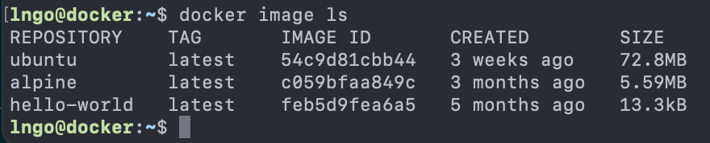

```


```{admonition} Search images
:class: dropdown

- We can search for available images in the public Docker Hub 

~~~bash
docker search mysql
~~~

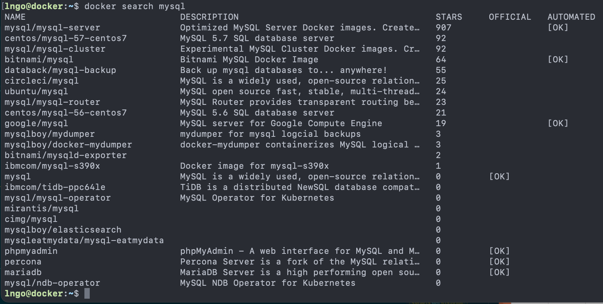

- Run a few searches to find images relevant to your project

```


```{admonition} General steps to create an image
:class: dropdown

- Create a container using an appropriate base distro
- Inside the container, install and setup the necessary software
- Review the changes in the container
- Turn the container into a new image
- Tag the image

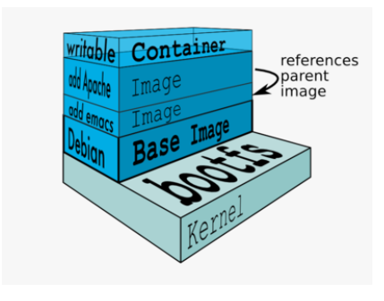

```


```{admonition} Hands-on: create a container with a base distro
:class: dropdown

- Launch an interactive container based on the `ubuntu` image. 
  - Remember to note your container ID. 

~~~bash
docker run -it ubuntu
~~~

- Install `figlet` inside the container, then exit out. 

~~~
# apt-get update
# apt-get install -y figlet
# exit
~~~

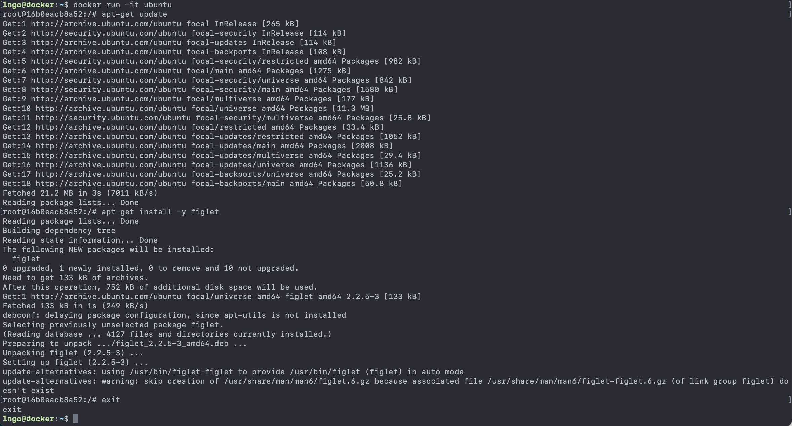

- Check for differences
  - Remember to note your container ID. 
  - In the command below, I used `16b0` because it was my 
  container ID. You can see that from the above screenshot: `root@16b0eacb8a52#` 
  was the prompt, then `16b0eacb8a52` is the container ID. 
  - We don't have to use the entire hash string, only the first 4-5 characters. 

~~~bash
docker diff 16b0
~~~

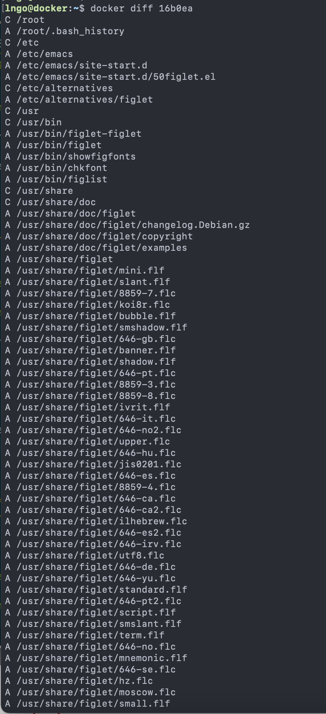

- A: A file or directory was added
- D: A file or directory was deleted
- C: A file or directory was changed

```


```{admonition} Commit changes into a new image
:class: dropdown

- Remember to note your container ID. 

~~~bash
docker commit 16b0 ubuntu_figlet_$USER
~~~

- The generated hash is also the image ID to be used later. 

~~~bash
docker image ls
docker history fe101
~~~

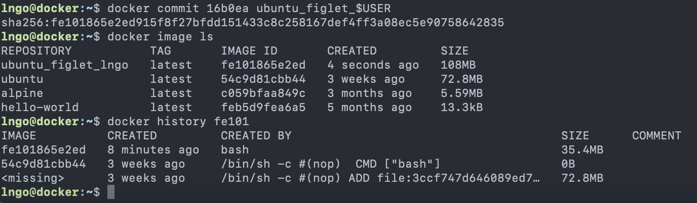

- From the screenshot:
  - The `docker commit ...` command created a new image named `ubuntu_figlet_lngo` that 
  has the following unique id: `fe101865e2ed`. 
  - The `docker image ls` command shows this image.
  - The `docker history fe101` shows the layers making up this image, which include 
  the layer that is the base ubuntu image `54c9d`. 

```


```{admonition} Exercise
:class: dropdown

- Test run the new `ubuntu_figlet` image by launching an interactive container
using this image, then immediately run `figlet hello world`. 

```


## 5. Automatic image construction: Dockerfile

```{admonition} Overview
:class: dropdown

- A build recipe for a container image.
- Contains a series of instructions telling Docker/Podman how an image is to be constructed.
- The `docker build` command builds an image from a Dockerfile.

```

```{admonition} Writing the first Dockerfile
:class: dropdown

- The following commands are done in the terminal (Ubuntu WSL on Windows/Mac Terminal). 

~~~bash
cd
mkdir myimage
cd myimage
nano Dockerfile
~~~

- Type the following contents into the nano editor
  - Save and quit after you are done. 

<script src="https://gist.github.com/linhbngo/b9f794bed306562f2eb85da310ae7b5e.js?file=Dockerfile.1"></script>

- `FROM`: the base image for the build
- `RUN`: represents one layer of execution. 
- `RUN` commands must be **non-interactive**.

```

```{admonition} Build the image
:class: dropdown

- Check that you are still inside `myimage`

~~~bash
pwd
docker build -t figlet_$USER .
~~~

- `-t` indicates a tag named `figlet` will be applied to the image. 
- `.` indicates that the `Dockerfile` file is in the current directory. 

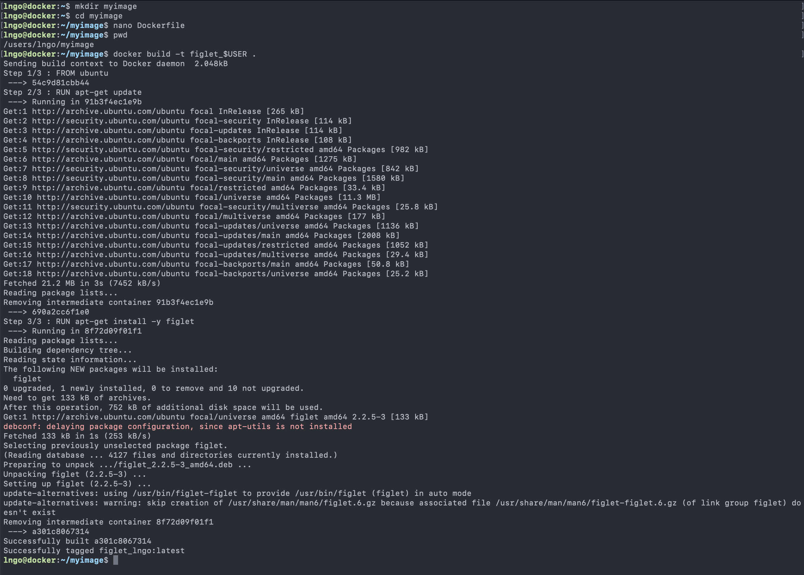

- The build context is the `Dockerfile` file in the current directory (`.`)
and is sent to the container engine. This context allows constructions of images 
with additional resources from local files inside the build context.
- The base image is `Ubuntu`.
- For each `RUN` statement, a container is created from the base image for the execution of the 
- commands. Afterward, the resulting container is committed into an image that becomes the 
base for the next `RUN`. 

```


```{admonition} Exercise
:class: dropdown

- Use `docker image ls` and `docker history ...` to check which layer is reused for
this image. 
- Test run the new `ubuntu_figlet` image by launching an interactive container
using this image, then immediately run `figlet hello world`. 

```

```{admonition} Dockerfile notation: CMD
:class: dropdown

- Edit your Dockerfile so that it has the following content

<script src="https://gist.github.com/linhbngo/b9f794bed306562f2eb85da310ae7b5e.js?file=Dockerfile.2"></script>

- `CMD`: The command to be run if the container is invoked without
any command. 
  - Running containers become similar to a process
- Rebuild the image with the tag `figlet_cmd_$USER`. 
- Run the following command

~~~bash
docker run figlet_cmd_$USER
~~~

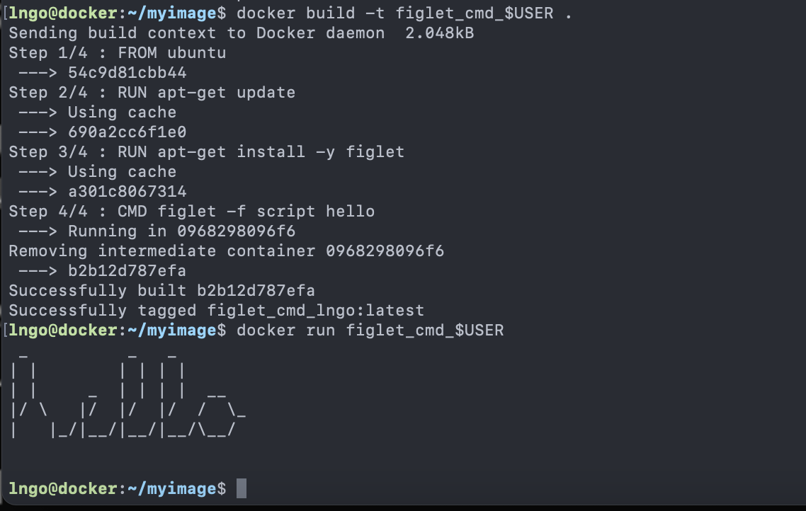

- Question: Did we use any additional storage for this new image?
- You can also override `CMD`
  - With CMD, the `-it` flag does not behave as expected 
  without a parameter. 
  - To override CMD, we can provide a command

~~~bash
docker run -it figlet_cmd_$USER
docker run -it figlet_cmd_$USER bash
~~~

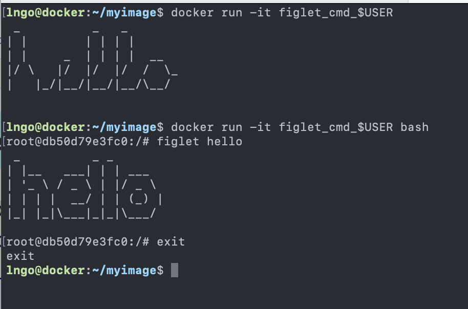

```


```{admonition} Dockerfile notation: ENTRYPOINT
:class: dropdown

-`ENTRYPOINT` defines a base command (and its parameters) 
for the container. 
- The command line arguments are appended to those parameters. 
- Edit `Dockerfile` as follows:

<script src="https://gist.github.com/linhbngo/b9f794bed306562f2eb85da310ae7b5e.js?file=Dockerfile.3"></script>

- Rebuild the image with the tag `figlet_entry_$USER`. 
- Run the followings:

~~~bash
$ docker run figlet_entry_$USER golden rams
~~~

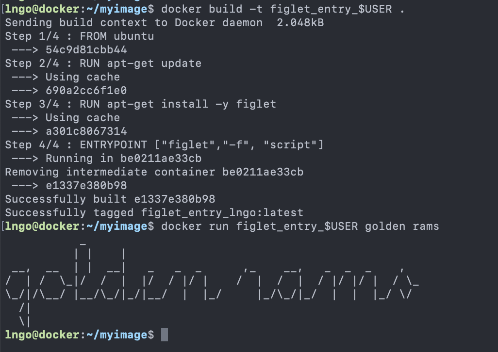

- `ENTRYPOINT` and `CMD` can be used together. 
- The command line arguments are appended to those parameters. 
- Edit `Dockerfile` as follows:

<script src="https://gist.github.com/linhbngo/b9f794bed306562f2eb85da310ae7b5e.js?file=Dockerfile.4"></script>

- Rebuild the image with the tag `figlet_both_$USER`. 
- Run the followings:

~~~
$ docker run figlet_both_$USER golden rams
$ docker run figlet_both_$USER
~~~

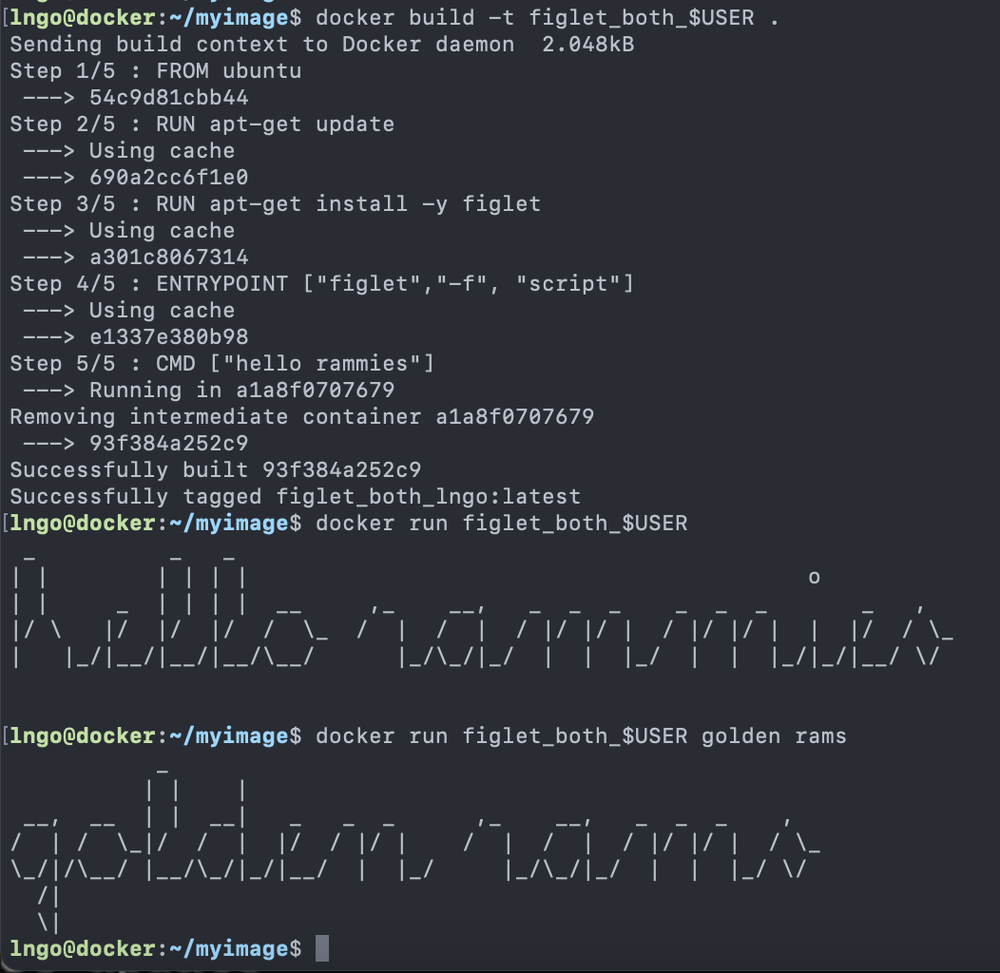


- **Big caveat**
  - `/bin/bash` does not work as expected.  
  - We have to override `ENTRYPOINT` by using the `--entrypoint` flag. 

~~~bash
docker run -it figlet_both_$USER bash
docker run -it --entrypoint bash figlet_both_$USER
exit
~~~

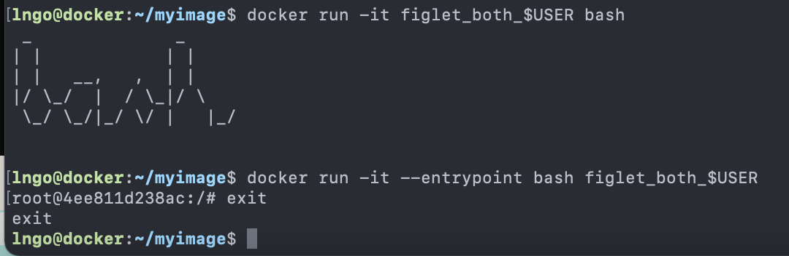

```

```{admonition} Dockerfile notation: COPY
:class: dropdown

- We can use `COPY` to import and build external code
- Create the following file called `hello.c` in `myimage` directory:

<script src="https://gist.github.com/linhbngo/b9f794bed306562f2eb85da310ae7b5e.js?file=hello.c"></script>

- Create the following Dockerfile called `Dockerfile.hello` in `myimage` directory:
  - Line 4: Copy `hello.c` into the `/` directory
  - Line 5: Run `gcc` on `hello.c` and create and executable named `hello` inside the `/` directory 

<script src="https://gist.github.com/linhbngo/b9f794bed306562f2eb85da310ae7b5e.js?file=Dockerfile.5"></script>

- You can build an image with a specific Dockerfile

~~~bash
docker build -t hello_$USER -f Dockerfile.hello .
docker run hello_$USER
~~~

```

```{admonition} Exercise
:class: dropdown

- Create an account on [Docker Hub](https://hub.docker.com). 
- Find out how to login from the command line and push the recently created `hello` image 
to your Docker Hub account. 

```

```{admonition} Dockerfile notation: EXPOSE
:class: dropdown

- We must use `EXPOSE` to expose ports for service from `inside` the container. 
- Create the following Dockerfile called in `myimage` directory:

<script src="https://gist.github.com/linhbngo/b9f794bed306562f2eb85da310ae7b5e.js?file=Dockerfile.6"></script>

- Build the Docker image. 

~~~bash
docker build -t httpd_$USER .
~~~

- Attempt to run the image in the background by executing:

~~~bash
docker run -d -P httpd_$USER
docker ps
~~~

- Do you see any port?
- Practice your documentation reading skill by doing the following:
  - Stop the container(s) running on the previous image using `docker container stop`
  - Remove stopped containers (Hint: run `docker container` to find out the magic operation)
  - Remove the previously created image. 

- Modify the Dockerfile as follows:

<script src="https://gist.github.com/linhbngo/b9f794bed306562f2eb85da310ae7b5e.js?file=Dockerfile.7"></script>

- Rebuild and rerun

~~~bash
docker build -t httpd_$USER .
docker run -d -P httpd_$USER
docker ps
~~~

- Can you visit and see the page now?

```


## 6. Networking in Docker

```{admonition} Overview
:class: dropdown

- Manually add the containers to the infrastructure via container-generated public port. 
- Predetermine a port on the infrastructure, then set the corresponding port mapping 
when run the containers.
- Use a network plugin to connect the containers with network tunnels/VLANS …
- Deploy containers across a physical cluster using Kubernetes.  

```


```{admonition} Container network model
:class: dropdown

- Provide the notion of a `network` to connect containers
- Provide top level command to manipulate and observe these networks: 
  - `docker network`

~~~bash
docker network
docker network ls
~~~

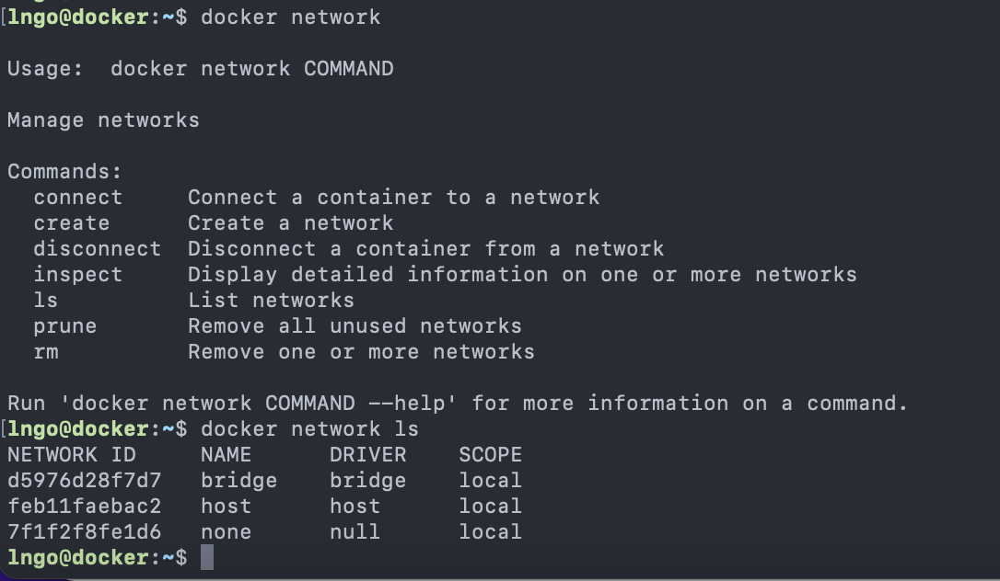

```

```{admonition} What's in a container network?
:class: dropdown

- Conceptually, it is a virtual switch
- It can be local to a single Engine (on a single host) or global 
(spanning multiple hosts).
- It has an associated IP subnet.
- The container engine will allocate IP addresses to the containers connected to a network.
- Containers can be connected to multiple networks.
- Containers can be given per-network names and aliases.
- The name and aliases can be resolved via an embedded DNS server. 

```

```{admonition} Hands on: create a network
:class: dropdown

~~~bash
docker network create ramnet
docker network ls
~~~

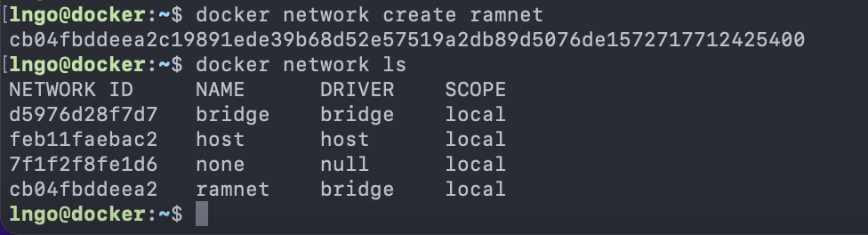

- You can place containers on a network

~~~bash
docker run -d --name es --net ramnet elasticsearch:2
docker run -it --net ramnet alpine sh
ping es
exit
~~~

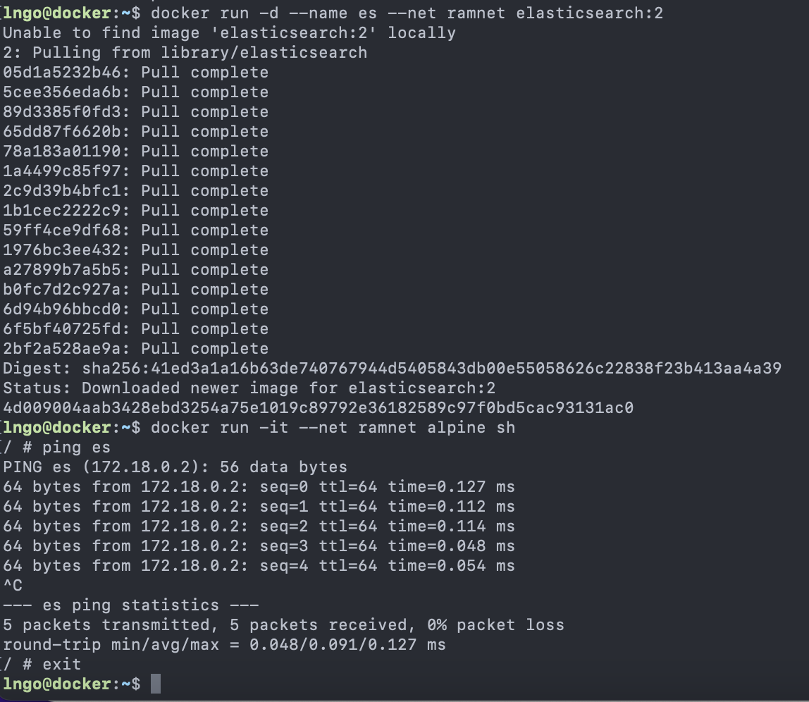

```
