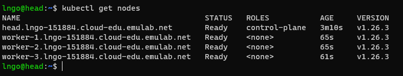
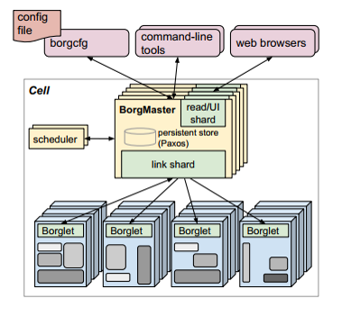
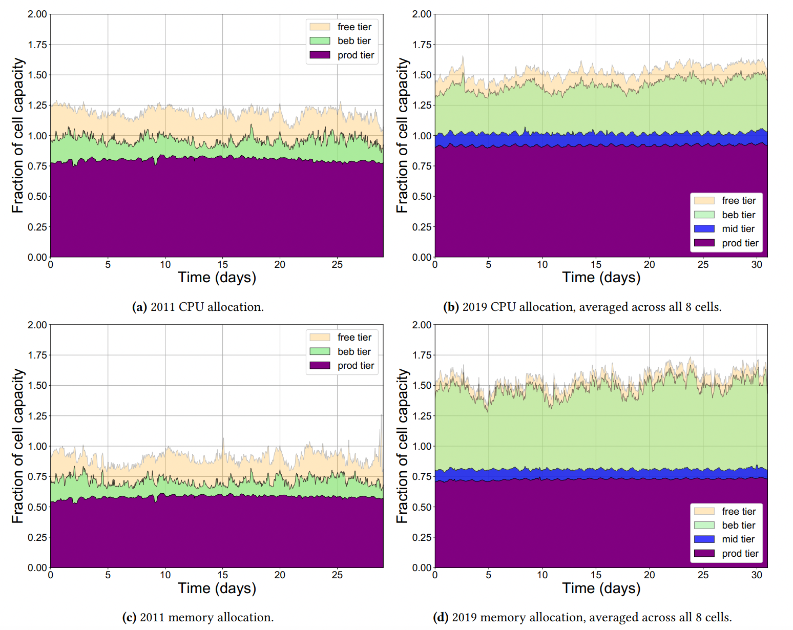
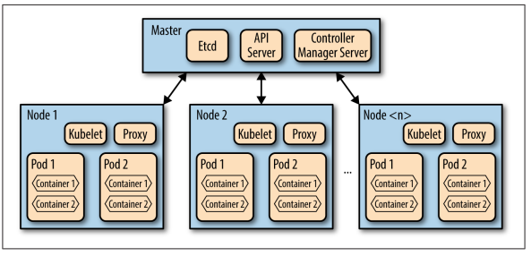
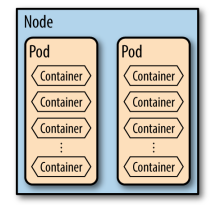
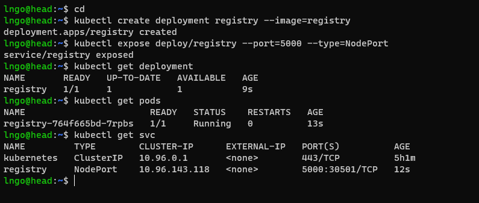
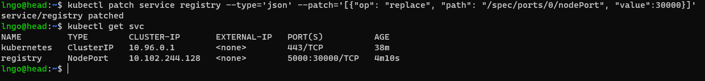

# Kubernetes

## 1. Overview 

```{admonition} Setup
:class: dropdown

- Each student should launch one instance of the **k8s-helm** branch (9eb0508e) from my 
profile **csc468ngo**.
- When it gets to the `Parameterize` stage, set the following options
  - `Number of nodes (3 or more)`: 3
  - `CloudLab user ID to deploy K8s from (should be your CloudLab ID. Defaulted to none)`: 
  This should be your CloudLab user ID. 
  - `Number of cores in each node (4 or more): 4
  - `MB of RAM in each node`: 8192
- For cluster selection, go with `Emulab` 
- Once the experiment is ready and all startup are `Finished`, run the following to confirms:

~~~bash
kubectl get nodes
~~~

- In the figure below, you can see that I have 4 nodes, when I launched a 4-nodes experiment. 
You should see a list of 3 nodes (1 head and 2 workers).



```

```{admonition} What does orchestrate mean?
:class: dropdown

- Dictionary definition: *to arrange or combine so as to achieve a desired or maximum effect*
  - Kubernetes documentation: *We tell Kubernetes what the desired state of our system 
  is like, and Kubernetes will work to maintain that*
- Before containerization/virtualization, we have cluster of computers running jobs.
  - Jobs = applications running on single or multiple computing nodes
  - Applications' dependencies are tied in to the supporting operating system on these nodes.
  - Cluster management system only need to manage applications. 
- Container is more than an application. 
  - A lightweight virtualization of an operating system and its components that help an application
  to run, including external libraries.
  - A running container does not depending on a host computer's libraries. 
  - Is the management process the same as a cluster management system? 
```


```{admonition} Before Kubernetes: Borg, a cluster management system
:class: dropdown

- Google’s Cluster Management System
  - First developed in 2003.
  - Abhishek Verma, Luis Pedrosa, Madhukar Korupolu, David Oppenheimer, Eric Tune, 
  and John Wilkes. `Large-scale cluster management at Google with Borg.` In 
  Proceedings of the Tenth European Conference on Computer Systems, p. 18. ACM, 2015.
  - Manages hundreds of thousands of jobs, from many thousands of different applications, across 
  clusters up to tens of thousands machines. 
- Borg is the predecessor of Kubernetes. Understand Borg helps understand the 
design decision in creating Kubernetes. 
  - Kubernetes is perhaps the most popular open-source container orchestration
  system today, for both academic and industry. 
  - Other container orchestration systems are either
    - Deprecating (Docker Swarm)
    - Integrates container management as part of the existing framework rather 
      than developing a new management system (UC Berkeley's Mesos and Twitter's Aurora) 

```

```{admonition} Benefits of Borg
:class: dropdown

- Hides the details of resource management and failure handling so its users can 
focus on application development. 
- Operates with very high reliability and availability, and supports applications 
that have similar requirements. 
- Runs workloads across tens of thousands of machines efficiently. 
- Is not the first system that can do these, but is one of the very few that 
can do it at such scale. 

```

```{admonition} Borg from a user's perspective
:class: dropdown

- Work is submitted to Borg as jobs, which can have one or more tasks (binary). 
- Each job runs in one Borg cell, consisting of multiple machines that are managed 
as a single unit. 
- Job types:
  - Long running services that should never goes down and have short-lived 
  latency-sensitive 
  requests: Gmail, Google Docs, Web Search …
  - Batch jobs that take a few seconds to a few days to complete. 
- Borg cells allow for not just applications, but applications frameworks
  - One master job and one or more worker jobs. 
  - The framework can execute parallel applications itself. 
  - Examples of frameworks running on top of Borg:
    - MapReduce
    - FlumeJava: Data-Parallel Pipelines
    - Millwheel: Fault-tolerant Stream Processing at Internet Scale
    - Pregel: Large-scale graph processing
- Machines in cells belong to a single cluster, defined by the 
high-performance datacenter-scale network fabric connecting them. 
  - How is this different that the traditional cluster model?
- A Borg’s alloc defines a reserved set of resources on a machine in which one or more tasks 
can be run. 

```

```{admonition} Borg's architecture
:class: dropdown

- Borg Master
- Borglet



- Scalability of Borg Master
  - Reported in the 2015 paper: `Unsure of the ultimate scalability limit` (flex anyone?)
  - A single master can 
    - manage many thousands machines in a cell
    - several cells have arrival rates of more than 10,000 tasks per minute. 
  - 2020 Borg analysis report:
    - (Muhamad Tirmazi, Adam Barker, Nan Deng, Md E. Haque, Zhijing Gene Qin, Steven Hand, 
    Mor Harchol-Balter, and John Wilkes. "Borg: the next generation." In Proceedings of the fifteenth European conference on computer systems)[https://dl.acm.org/doi/pdf/10.1145/3342195.3387517]
  - 2011 log data: 1 cell, 12000 machines (40 GB compressed)
  - 2020 log data: 8 cells, 96000 machines (350 GB compressed)
- The below graph show fraction of CPU and memory **allocation** of each category
of priority queue **relative to cell's capacity". 
- What is special about this?



```

## 2. Kubernetes

```{admonition} Where does it come from
:class: dropdown

- Developed from lessons learned via Borg
- Become available with the initial release of Docker in March 2013

```

```{admonition} Applications versus services
:class: dropdown

- A service is a process that:
  - is designed to do a small number of things (often just one).
  - has no user interface and is invoked solely via some kind of API.
- An application is a process that: 
  - has a user interface (even if it’s just a command line) and 
  - often performs lots of different tasks. It can also expose an API,
- It is common for applications to call several service behind the scenes

```

```{admonition} What does Kubernetes have?
:class: dropdown

- Kubelet: a special background process responsible for create, destroy, 
and monitor containers on a host. 
- Proxy: a simple network proxy used to separate IP address of the container 
from the service it provides. 
- cAdvisor: collects, aggregates, processes, and exports information about 
running containers. 



- Pods
  - A collection of containers and volumes that are bundled and scheduled 
  together because they share a common resource (same file system or IP address). 
  - Docker: Each container gets its own IP
  - Kubernetes: Containers of a pod share the same address. 
  - A pod emulates a logical host (like a VM) to the containers. 



- Important:
  - Kubernetes schedules and orchestrates things at the pod level, not 
  at the container level. 
  - Containers running in the same pod have to be managed together (shared fate). 
  - Management transparency: You don’t have to micromanage processes within a pod. 

```

```{admonition} What Kubernetes learned from Borg
:class: dropdown

- Rejection of the `job` concept and organize around the concept of `pods`. 
  - `labels` are used to described the `objects` (`jobs`, `services`, ...) 
  and their desired states. 
- IP addresses are mapped to `pods` and `services` and not physical computers. 
- Optimizations for high-demand jobs.  
- The perception of Kubernetes' kernel as an operation system kernel for a 
distributed system. 

```


## 3. Kubernetes: Pods, Service, Deployment

```{admonition} Overview
:class: dropdown

- This is done via Kubernetes Objects, described through YAML files. 
- **Kubernetes objects** are persistent entities in the Kubernetes system, which represent the 
state of your cluster. 
  - What containerized applications are running (and on which nodes)
  - The resources available to those applications
  - The policies around how those applications behave, such as restart policies, upgrades, and fault-tolerance
- *A Kubernetes object is a "record of intent"--once you create the object, the Kubernetes system will 
constantly work to ensure that object exists. By creating an object, you're effectively telling the 
Kubernetes system what you want your cluster's workload to look like; this is your cluster's desired state.*
- [Documentation](https://kubernetes.io/docs/reference/kubernetes-api/)

```


```{admonition} Terminologies: Pods
:class: dropdown

- `Pod`: Smallest deployable units of computings that can be created 
and managed in Kubernetes
- A pod can contain one or more containers with shared storage and 
network resources and specifications for how to run the containers. 
- Create the following file called `nginx.yml`

<script src="https://gist.github.com/linhbngo/b9f794bed306562f2eb85da310ae7b5e.js?file=nginx.yml"></script>

- Deploy the pod:

~~~bash
kubectl apply -f nginx.yml
kubectl get pods
kubectl describe pods nginx
~~~

- How to access this nginx container?

```

```{admonition} Terminologies: Service
:class: dropdown

- `Service`: A method of exposing network application running 
as one or more Pods without making any changes to the application. 
- Each `Service` object defines a logical set of endpoints (usually 
endpoints are pods) along with a policy about how to make those 
pods accessible. 
- For exposing `Service` to an external IP address, there are several types:
  - ClusterIP
  - NodePort
  - LoadBalancer
  - ExternalName
- `ClusterIP`: expose service onto a cluster-internal (Kubernetes) IP. For 
world access, `Ingress` needs to be used. 
- `NodePort`: Expose the service on each `Node` (worker computers) at a static 
port. 

<script src="https://gist.github.com/linhbngo/b9f794bed306562f2eb85da310ae7b5e.js?file=nginx-svc.yml"></script>

- Deploy the service:

~~~bash
kubectl apply -f nginx-svc.yml
kubectl get svc
kubectl describe svc nginx
~~~

- Visit the headnode of your Kubernetes cluster at the nodePort 30007. 

```

```{admonition} Terminologies: Deployment
:class: dropdown

- `Deployment`: provides declarative updates for `Pods` (and `ReplicaSets`) .
  - A *desired state* is described in a Deployment. 

<script src="https://gist.github.com/linhbngo/b9f794bed306562f2eb85da310ae7b5e.js?file=nginx-deployment.yml"></script>

- Deploy the application:

~~~bash
kubectl delete pods nginx
kubectl delete svc nginx
kubectl apply -f nginx-deployment.yml
kubectl get deployment nginx-deployment
kubectl get svc
kubectl describe svc nginx
kubectl get pods
kubectl describe pods nginx
~~~

- Visit the headnode of your Kubernetes cluster again at the nodePort 30007. 
- Delete the deployment

~~~bash
kubectl delete deployment nginx-deployment
~~~

```

## 4. Kubernetes Dashboard

```{admonition} Deploy the dashboard
:class: dropdown

- Run the following commands 

~~~bash
cd /local/repository
bash launch_dashboard.sh
~~~

- Go to the `head` node URL at port `30082` for `kubernetes-dashboard`
- Hit `skip` to omit security (**don't do that at your job!**).

```

```{admonition} Kubernetes namespace
:class: dropdown

- Provides a mechanism for isolating groups of resources within a single cluster. 
- Uniqueness is enforced only  within a single namespace for namespaced objects 
  (`Deployment` and `Services`)
- Uniquess of other cluster-wide objects (`StorageClass`, `Nodes`, `PersistentVolumes`, etc) is 
  enforced across namespaces. 
- Run the following commands from inside the `ram_coin` directory
- `namespaces`, `namespace` or `ns`

~~~bash
kubectl get namespaces
kubectl get ns
kubectl get namespace
~~~

- Using `--namespace` or `-n` let you specify a namespace and look at objects within 
that namespace. 
- Without any specification, it is the default namespace (`default`)

~~~bash
kubectl get ns
kubectl get pods -n kubernetes-dashboard
kubectl get pods
kubectl get services --namespace kubernetes-dashboard
kubectl get services
~~~


```

## 5. More Kubernetes Deployment

```{admonition} Launch ram_coin on Kubernetes
:class: dropdown

- First, we deploy a registry service. This is equivalent to a local 
version of Docker Hub.  
  - Only one member of the team does this

~~~bash
cd
kubectl create deployment registry --image=registry
kubectl expose deploy/registry --port=5000 --type=NodePort
kubectl get deployment
kubectl get pods
kubectl get svc

~~~



- We can patch configurations of deployed services to set a specific external port. 

~~~bash
kubectl patch service registry --type='json' --patch='[{"op": "replace", "path": "/spec/ports/0/nodePort", "value":30000}]'
kubectl get svc
~~~

- You can see the external port has now been changed (patched)



```


```{admonition} Building and pushing images for ramcoin
:class: dropdown

- We test our local registry by pulling `busybox` from Docker Hub and then 
tag/push it to our local registry. 

~~~bash
docker pull busybox
docker tag busybox 127.0.0.1:30000/busybox
docker push 127.0.0.1:30000/busybox
curl 127.0.0.1:30000/v2/_catalog
~~~

- Next, we clone ramcoin repository

~~~bash
cd
git clone https://github.com/CSC468-WCU/ram_coin.git
cd ram_coin
docker-compose -f docker-compose.images.yml build
docker-compose -f docker-compose.images.yml push
curl 127.0.0.1:30000/v2/_catalog
kubectl create deployment redis --image=redis
for SERVICE in hasher rng webui worker; do kubectl create deployment $SERVICE --image=127.0.0.1:30000/$SERVICE:v0.1; done
kubectl expose deployment redis --port 6379
kubectl expose deployment rng --port 80
kubectl expose deployment hasher --port 80
kubectl expose deploy/webui --type=NodePort --port=80
kubectl get svc
~~~

- Identify the port mapped to port 80/TCP for webui service. You can 
use this port and the hostname of the `head` node from CloudLab to access 
the now operational ram coin service. 

~~~bash
$ kubectl get svc
$ kubectl get pods
~~~

```

```{admonitio} Exercise
:class: dropdown

- Patch the webui service so that it uses port 30080 as the external port

```


## 6. Automated Kubernetes Deployment 

```{admonition} Ramcoin dpeployment
:class: dropdown

~~~bash
kubectl create namespace ramcoin
kubectl create -f ramcoin.yaml --namespace ramcoin
kubectl get pods -n ramcoin
kubectl create -f ramcoin-service.yaml --namespace ramcoin
kubectl get services --namespace ramcoin
~~~

```

```{admonition} Automated recovery 
:class: dropdown

- Check status and deployment locations of all pods on the `head` node

~~~bash
kubectl get pods -n ramcoin -o wide
~~~

- SSH into `worker-1` and reset the Kubelet. Enter `y` when asked. 

~~~bash
sudo kubeadm reset
~~~

- Run the following commands on `head` to observe the events 
  - After a few minutes, `worker-1` becomes `NotReady` via `kubectl get nodes`
  - After five minutes, `kubectl get pods -n ramcoin -o wide` will show that 
  pods on `worker-1` being terminated and replications are launched on `worker-2` 
  to recover the **desired state** of ramcoins. 
  - The five-minute duration can be set by the `--pod-eviction-timeout` parameter. 

~~~bash
kubectl get nodes
kubectl get pods -n ramcoin -o wide
~~~

```


