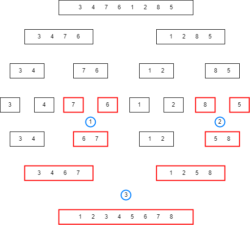
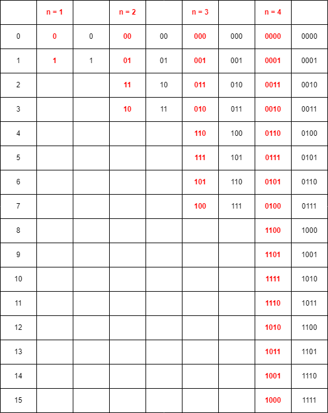
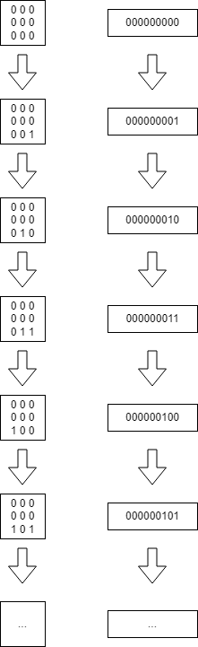

# Data structures and supporting libraries

## 1. Overview and motivation

- Data Structures: a mean to store and organize data. 
- Pick an appropriate DS that support efficient insertions, searches/queries, deletions, and updates. 
- Assumption: familiarity with the data structures discussed in the remainder of this episode. 
- You only need to **know enough** so that you can **select** and **use** the **correct data structures**.
  - Understand the strengths, weaknesses, and time/space complexities. 
  

## 2. Linear Data Structure: Array

```{admonition} Overview
:class: dropdown

- Many builtin support for Java/C++. We focus on Java for this class. 
- Static Array: [Builtin supports in Java](https://docs.oracle.com/en/java/javase/11/docs/api/java.base/java/util/Arrays.html)
- Dynamic Array: [ArrayList](https://docs.oracle.com/en/java/javase/11/docs/api/java.base/java/util/ArrayList.html)
- Sorting: 
  - Java Array has builtin sort. 
  - ArrayList: inherits `sort` from [Java Collections](https://docs.oracle.com/en/java/javase/11/docs/api/java.base/java/util/Collections.html)
  - `O(n^2)`: Bubble, Selection, Insertion
  - `O(nlog(n))`: Merge, Quick, Heap
  - `O(n)`: Counting, Radix, Bucket
- Searching (on a sorted linear data structure):
  - `O(n)`: linear search
  - `O(log(n))`: binary search ([Java Collections](https://docs.oracle.com/en/java/javase/11/docs/api/java.base/java/util/Collections.html))
- Array of Booleans: [Java BitSet](https://docs.oracle.com/en/java/javase/11/docs/api/java.base/java/util/BitSet.html)

```


```{admonition} UVa problem 12150: Pole Position
:class: dropdown
[Problem's link](https://onlinejudge.org/index.php?option=com_onlinejudge&Itemid=8&category=243&page=show_problem&problem=3302)


:::::{tab-set}
::::{tab-item} Descriptions

- Initial array: car number at each index. 
- Subsequent array: car numbers and their relative displacement. 
  
::::
::::{tab-item} IO format

- First value is the `N` number of cars. 
  - Next `N` pairs are the cars and their relative displacement. 
  - Repeat with a new `N` until `N` == 0. 
- N between 2 and 1000
- C between 1 and 10000
- P between -1000000 and 1000000

::::
::::{tab-item} Thought Process

- Initial visualization: 
  - 2-dimensional array, 1 column for car number and 1 column for relative positions. 
  - Imagine the starting position, the entire second column would be 0s.  
- Input data contain the cars at **new index position** (first column), and **displacement** from initital positions.  
  - Current index **plus** (or **minus**?) displacement will provide initial position. 
- Do we actually need a 2-dimensional array?  
- What are the possible edge cases for invalid starting positions? 
  
::::
::::{tab-item} AC

<script src="https://gist.github.com/linhbngo/3529c879f8375d9e7eb29f355805bc0c.js?file=12150.java"></script>

::::
:::::

```

```{admonition} Challenges
:class: dropdown

- Kattis: [Baloni](https://open.kattis.com/problems/baloni)
- Kattis: [Greedily Increasing Subsequence](https://open.kattis.com/problems/greedilyincreasing)
- Kattis: [Mastermind](https://open.kattis.com/problems/mastermind)
- Kattis: [Nine Knights](https://open.kattis.com/problems/nineknights)
- LeetCode: [Valid Sudoku](https://leetcode.com/problems/valid-sudoku/)
- LeetCode: [Container With Most Water](https://leetcode.com/problems/container-with-most-water/)
- LeetCode: [Jump Game](https://leetcode.com/problems/jump-game/)
- Kattis: [Epig Dance Off](https://open.kattis.com/problems/epigdanceoff)
- Kattis: [Flowshop](https://open.kattis.com/problems/flowshop)

```


## 3. Special Sorting Problems

```{admonition} Overview
:class: dropdown

- Inversion Index: count the number of swap to make a list into a sorted order
  - `O(n^2)`: actual runs bubble sort. 
  - `O(nlog(n))`:
    - Modification of Merge Sort: increment count by one when the `front right` is selected in the merging process before the `front left`. 
- Sorting in linear time:
  - Depending on data type
  - `O(n + k)` Counting Sort
  - `O(d * (n + k))` Radix Sort



```


```{admonition} Kattis: Height
:class: dropdown

[Problem's link](https://open.kattis.com/problems/height)

:::::{tab-set}
::::{tab-item} Descriptions

- Students placement: Insertion Sort. 
- Count number of displacements due to insertion. 
  
::::
::::{tab-item} IO format

- First value is the `P` number of cases
- Each subsequent `21` integers:
  - First integer is case number (to be used in output)
  - Next twenty integers are the students' heights. 

::::
::::{tab-item} Thought Process

- Read each line and place 20 integers into array
- Perform insertion sort
  - Increase count if a swap is done. 
  
::::
::::{tab-item} AC

<script src="https://gist.github.com/linhbngo/3529c879f8375d9e7eb29f355805bc0c.js?file=kattis_height.java"></script>

::::
:::::

```


## 4. Linear Data Structure: Bitmask

```{admonition} Overview
:class: dropdown

- Use an signed interger to represent a `lightweight` small set of Boolean values. 
- This is faster than the `BitSet` class of Java. 
- Limitation: up to 64 items only. 
- Example: S = 34 
  - Binary: `1 0 0 0 1 0`
  - Index: `5 4 3 2 1 0`
  - Power of 2: `32 16 8 4 2 1`
  - Alphabet: `F E D C B A`.
  - S can represent `{1, 5}` or `{F, B}` or `{32, 2}`.
- To multiply/divide by 2, shift all bit left/right one:
  - `<< 1`: multiply by 2/shift left 1
  - `<< 2`: multiple by 4/shift left 2
  - `>> 1`: divide by 2/shift right 1. 
- To set (turn on) the bit at position `j`, use bitwise OR: `S = S | (1 << j)`
  - `1 << j` will shift 1 forward `j` position, every other bits remain 0. 
  - A bitwise OR of the above result with S will set the bit value of S at position `j` to 1. 
- To check if the bit at position `j` is on, use bitwise AND: `T = S & (1 << j)`.
  - `T == 0`: `j` bit is 0
  - `T != 0`: `j` bit is 1
- To clear/turn off the bit at position `j`: `S = S & ~(1 << j)`
- To flip the bit at position `j`: `S = S ^ (1 << j)`
- To get the value of the least significant bit of S that is on: `T = ((S) & -(S))`
  - Negative S, not flipped bits of S. 
- To turn on all bits in a set of size `n`: `S = (1 << n) - 1`

```


```{admonition} UVa problem 11173: Gray Codes
:class: dropdown

[Problem's link](https://onlinejudge.org/index.php?option=com_onlinejudge&Itemid=8&category=23&page=show_problem&problem=2114)


:::::{tab-set}
::::{tab-item} Descriptions

- You will be given total number of cases: `N <= 250000`
- For each case:
  - You will be given number of bits: `1 <= n <= 30`
  - You will be given the `k` position of the `n-bit` Reflected Gray Code: `0 <= k <= 2^n`. 
- Run time is most likely an issue to be considered here. 

::::
::::{tab-item} IO format

- Type 1: The number of cases is given in the first line
- Each case involves parsing two integers.   
- Nothing special for output.  

::::
::::{tab-item} Thought Process

- Bit operations would be fastest. 
  - Textbook suggestion: one-liner bit manipulation expression. 
  - What is the pattern here?
    - Do not look at the value of the bits, it is the output, not the pattern. 



- If an even bit is set, the flip the next bit?
  - Not good enough. 
- XOR patterns, can you see it?

::::
::::{tab-item} AC

<script src="https://gist.github.com/linhbngo/3529c879f8375d9e7eb29f355805bc0c.js?file=11173.java"></script>

::::
:::::

```

```{admonition} UVa problem 11581: Grid Successors
:class: dropdown

[Problem's link](https://onlinejudge.org/index.php?option=com_onlinejudge&Itemid=8&category=27&page=show_problem&problem=2628)

:::::{tab-set}
::::{tab-item} Descriptions

- 3x3 grid, each cell containings 0 or 1 
- Function `f` is the standard cell-based transformation that is similar to the 
[Game of Life](https://en.wikipedia.org/wiki/Conway%27s_Game_of_Life)'s principle: 
  - Each cell's transformation depends on the adjacent cells. 
    - Sum of adjacent cells modulo 2: resulting values will be 0 or 1. 
    - Needs to pay attention to border cells. 
  - The recursive function starts from the original grid, and there is a chance that 
  over time, it will transform one of the subseqeuent grid back to the original grid. 
  - The value i = k<sub>g</sub>(h) such that h=f<sup>(i)</sup>(g)
    - Therefore: $k_{g}(f^{i}(g))$ means the number of steps `i` so that function `f` 
   transforms `g` back to itself. 

::::
::::{tab-item} IO format

- First value is the `N` number of grids. 
- Each group of subsequent four lines:
  - One empty line. 
  - Three lines, each of which is a string of three characters, either `0` or `1`. 

::::
::::{tab-item} Thought Process

- Should have a separate method for `f`. 
  - To know when `g` is transformed back to itself, this means we need to 
  keep track of the past data structures.   
  - Identify the finiteness of `i` is easy: we only need to know when the current grid matches the original grid. 
  - Identify the infinite case (ouptut of -1) is the question.   
    - Going back to the finite case, if the grid is transformed back to itself after `i` steps, this means 
    there is another circular tranformation back to itself after an additional `i` steps.  
    - If there exists a `circular transformation` that does not contain the original grid, this means 
    we have hit the infinite case. 
  - Implication: we need to know if the current grid matches **any** of the previous grid arrangement. 
  - The question: is the number of possible grid arrangement finite or infinite?  
    - Recall: Bitmask and Array



- With 9 bits, maximum possible grid arrangements = $2^9$ = 512

::::
::::{tab-item} AC

<script src="https://gist.github.com/linhbngo/3529c879f8375d9e7eb29f355805bc0c.js?file=11581.java"></script>

::::
:::::


```

```{admonition} Challenges
:class: dropdown

- Kattis: [Snapper Hard](https://open.kattis.com/problems/snapperhard)
- Kattis: [Bits](https://open.kattis.com/problems/bits)

```


## 5. Big Integer

```{admonition} Overview
:class: dropdown

- Use [Java's BigInteger](https://docs.oracle.com/en/java/javase/11/docs/api/java.base/java/math/BigInteger.html) for this purpose

```

```{admonition} Challenges
:class: dropdown

- Kattis: [Simple Addition](https://open.kattis.com/problems/simpleaddition)
- Kattis: [Wizardsof Odds](https://open.kattis.com/problems/wizardofodds)

```

## 6. Linked Data Structures

```{admonition} Overview
:class: dropdown

- [Java LinkedList](https://docs.oracle.com/en/java/javase/11/docs/api/java.base/java/util/LinkedList.html)
- [Java Stack](https://docs.oracle.com/en/java/javase/11/docs/api/java.base/java/util/Stack.html)
- [Java Queue](https://docs.oracle.com/en/java/javase/11/docs/api/java.base/java/util/Queue.html)
- [Java Double-ended Queue](https://docs.oracle.com/en/java/javase/11/docs/api/java.base/java/util/Deque.html)

```

```{admonition} Challenges
:class: dropdown

- [Valid parentheses](https://leetcode.com/problems/valid-parentheses/)
- [Check if a parentheses string can be valid](https://leetcode.com/problems/check-if-a-parentheses-string-can-be-valid/)

```


## 7. Non-linear Data Structures: Binary Heap (Priority Queue)

```{admonition} Overview
:class: dropdown

- [Java PriorityQueue](https://docs.oracle.com/en/java/javase/11/docs/api/java.base/java/util/PriorityQueue.html).
  - From node `i`:
    - To parent: `floor(i)` or `i>>1`
    - To left child: `2 * i` or `i<<1`
    - To right child: `2 * i + 1` or `(i<<1) + 1`
- Heap property:
  - Items on left and right subtree of root `x` are always smaller than `x`. 
  - The root is always the max-value item. 
- Highest value-item can be dequeued in `log(n)` time. 
- New item can be enqueue in `log(n)` time. 
- Important components for:
  - Prim's and Kruskal's algorithms for minimum spanning tree. 
  - Dijkstra's Single Source Shortest Path. 

```


```{admonition} Kattis problem: Knigs of the Forest
:class: dropdown

[Problem's link](https://open.kattis.com/problems/knigsoftheforest)


:::::{tab-set}
::::{tab-item} Descriptions


::::
::::{tab-item} Thought Process

- PriorityQueue
  - Two queues
  - Rewrite comparator to custom compare. 
  - [Writing custom comparator](https://www.callicoder.com/java-priority-queue/)
  - [More description on comparator - how do they compare?](https://docs.oracle.com/en/java/javase/11/docs/api/java.base/java/util/Comparator.html)

::::
::::{tab-item} AC

<script src="https://gist.github.com/linhbngo/3529c879f8375d9e7eb29f355805bc0c.js?file=kattis_knigsoftheforest.java"></script>

::::
:::::

```


```{admonition} Challenges
:class: dropdown

- Kattis: [Stock Prices](https://open.kattis.com/problems/stockprices)

```


## 8. Hash Table

- [Java HashMap](https://docs.oracle.com/en/java/javase/11/docs/api/java.base/java/util/HashMap.html)
- [Java HashSet](https://docs.oracle.com/en/java/javase/11/docs/api/java.base/java/util/HashSet.html)
- What we did in JollyJumper, TreasureHunt, ... could be considered a simple naive form 
of hashing called `Direct Addressing Table`. 

```{admonition} Kattis problem: Quick Brown Fox
:class: dropdown

[Problem's link](https://open.kattis.com/problems/quickbrownfox)

:::::{tab-set}
::::{tab-item} Descriptions


::::
::::{tab-item} Thought Process

- Direct Access Table
  - 1 if 0, no action otherwise.
  - Check sum and reset.  
- Accepted solution

::::
::::{tab-item} AC

<script src="https://gist.github.com/linhbngo/3529c879f8375d9e7eb29f355805bc0c.js?file=kattis_quickbrownfox.java"></script>

::::
:::::


```

```{admonition} Challenges
:class: dropdown

- Kattis: [What does the fox say?](https://open.kattis.com/problems/whatdoesthefoxsay)

```


## 9. Balanced Binary Search Tree (bBST)
- Binary Search Tree implemented using  ADL (Adelson-Velskii Landis) or Red-Black
implementation. 
- [Java TreeMap](https://docs.oracle.com/en/java/javase/11/docs/api/java.base/java/util/TreeMap.html)
- [Java TreeSet](https://docs.oracle.com/en/java/javase/11/docs/api/java.base/java/util/TreeSet.html)
- Insertion/search/removal: `log(n)` time. 
- use bBST as a PriorityQueue ADT: `lastKey` for max value, `firstKey` for smallest value. 


## 10. Order Statistics Tree
- Selection: Find the k<sup>th</sup> smallest element of an array of n element. 
- Ranking: If the k<sup>th</sup> smallest element is `v`, then ranking of `v` is `k`. 
- Selection problem, static data:
  - `k=1` and `k=n`: manual comparison, best run time is `n`. 
  - For other cases: sort then compare, run time `nlog(n)`.
  - Best `n` algorithm: Utilize `RandPartition` of [QuickSort](https://docs.google.com/presentation/d/1oO-d_NrVzSvZ1cvoKvbrL3wHQJSeHGOpTdTud2FjCb0/edit#slide=id.p):
    - `q = RandPartition(A, 0, n-1)`, all element `<=` A[q] will be placed before
    the pivot, so A[q] will be in its correct order statistics, which is `q+1`. 
- Selection problem, dynamic data:
  - Construct a bBST
  - Preprocessing: `nlog(n)`
  - Actual answer: `log(n)` by traversing down the tree. 


